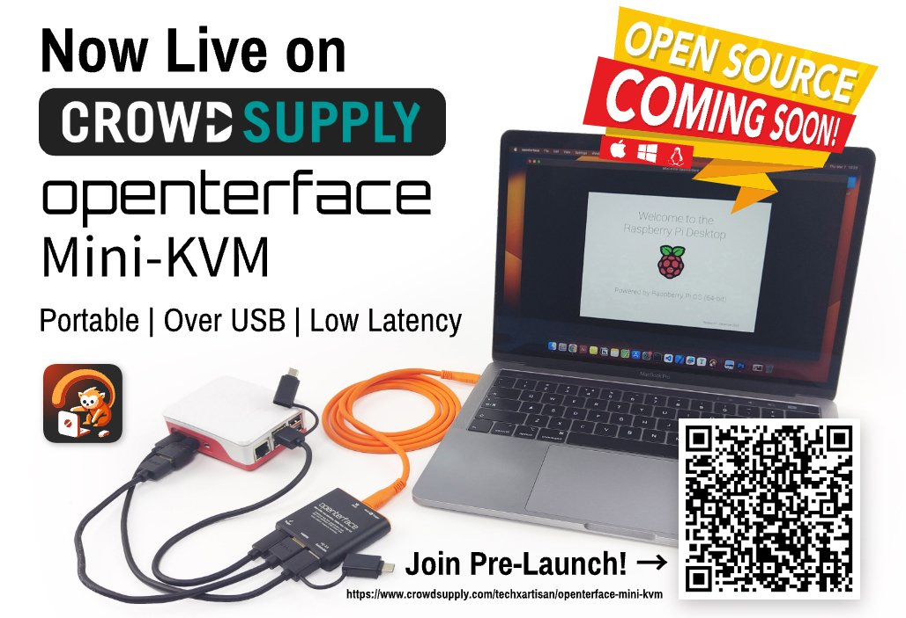

This is Github repo for hosting Openterface Mini-KVM's Website.

We've reached a pivotal moment: our [Pre-launch Page](https://www.crowdsupply.com/techxartisan/openterface-mini-kvm) is now live on **Crowd Supply**! This is a crucial step towards our official crowdfunding campaign, and we're eager to make it a success. By subscribing and considering to be our backer, you'll bring us closer to our goal and, ultimately, to delivering Mini-KVM Openterface to you faster.

---------

**Openterface Mini-KVM** allows you to control a headless target device, such as a mini PC, kiosk, or server, directly from your laptop or desktop without the need for an extra keyboard, mouse, and monitor.

It's a plug-and-play tool that connects via HDMI for display and USB for emulated keyboard/mouse (HID) signals. It requires minimal setup: install our host application on your host computer, and you're ready to have on-the-go headless control.

## Control Your Devices Whenever and Wherever

Whether you're an IT professional needing to troubleshoot a server, a developer managing multiple tests on edge computing machines, a tech enthusiast hacking single-board computers, or simply someone looking to declutter their desk, Openterface Mini-KVM is the solution.

## Features & Specifications  

- **Host App Compatibility**: Currently supports macOS, with support for Windows and Linux in development.

- **Plug-and-Play Convenience**: Headless control via HDMI and emulated keyboard/mouse, without network concern.

- **Portability**: Its compact and lightweight design makes it the perfect tool for professionals on the go.

- **Text Transfer from Host to Target**: Ideal for copying usernames, passwords, and small chunks of code to the target computer via our host applications.

- **Full HD with Low Latency**: Captures video via HDMI at a 1920x1080 resolution at 30fps, with under 140 milliseconds of latency. With the help of a video adapter, it can also support DisplayPort and DVI video sources.

- **Audio Integration**: Captures and plays the target device's audio directly on the host computer.

- **BIOS-Level Access**: Provides direct access to the target device's BIOS, firmware, or startup management.

- **Switchable USB Type-A Port**: This allows you to toggle USB access between the host and the target, ideal for sharing a USB drive without replugging.

- **Clean Setup**: Leaves no software on the target computer.

## Open Source

Openterface Mini-KVM is open hardware and uses open source host software. We will make more information available when the campaign begins. We're also working on documentation, which you can [read on our website](https://openterface.com/quick-start/).

## Interested in This Project?

You can sign up at our [Pre-launch Page](https://www.crowdsupply.com/techxartisan/openterface-mini-kvm) on **Crowd Supply** to be notified when the campaign launches and to receive other updates. We provide useful information only, and you can unsubscribe at any time.

## Contact Us

We're delighted you're interested in reaching out to us. Whether you have questions, feedback, or just want to say hello, here are several ways to connect with us:

### Official Contact Emails

To ensure you're communicating with us securely and directly, please note our official contact email addresses. For any enquiries, support, or feedback, feel free to reach out to us at:

- **Primary Contact Email:** [techxartisan@gmail.com](mailto:techxartisan@gmail.com)

Additionally, any email address ending with the following domains is recognized as an official communication channel for our members and customers:

- **TechxArtisan Domain:** *@techxartisan.com
- **Openterface Domain:** *@openterface.com

Emails from these addresses are from our team, dedicated to providing you with the support and information you need.

### Follow Us on Social Media

Stay updated and engaged with us through our social media channels:

- [Join our subreddit](https://www.reddit.com/r/Openterface_miniKVM/)
- [TechxArtisan on GitHub](https://github.com/TechxArtisan)
- [Follow us on Twitter](https://twitter.com/TechxArtisan)
- [Like us on Facebook](https://www.facebook.com/TechxArtisan)
- [Join our Discord community](https://discord.gg/4khsrbGS)
- [Subscribe to our YouTube channel](https://youtube.com/@TechxArtisan)
- [Follow us on LinkedIn](https://www.linkedin.com/company/techxartisan/)

### Visit Our Website

For more information about us and our work, please visit our website:

- [TechxArtisan Official Website](https://techxartisan.com/en/)
