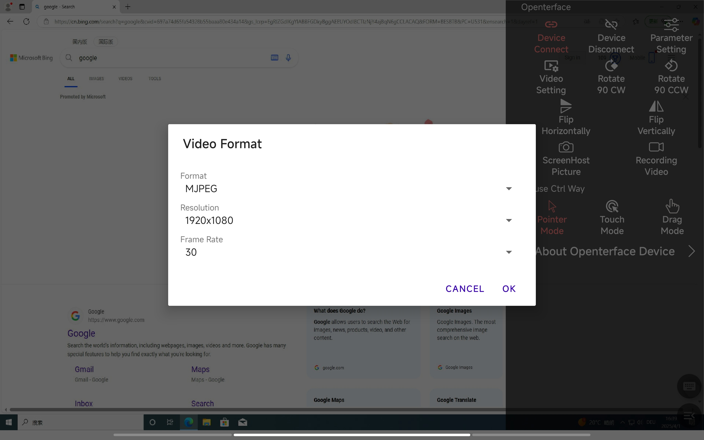
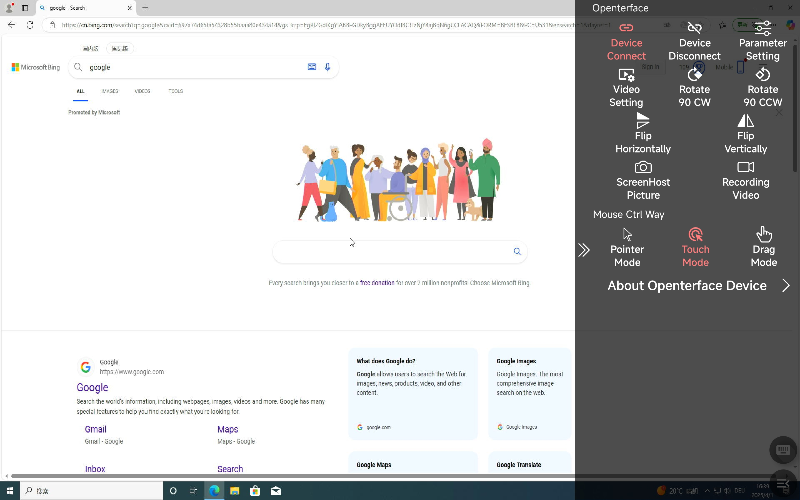
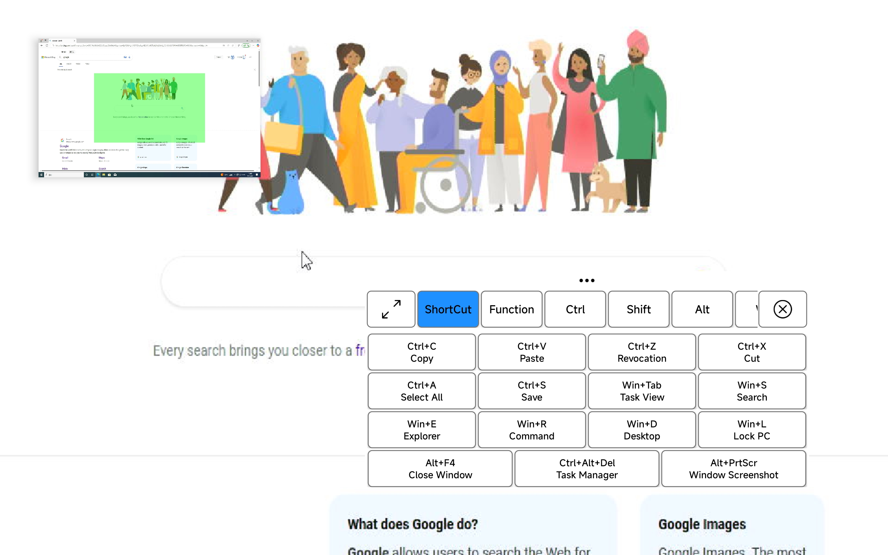
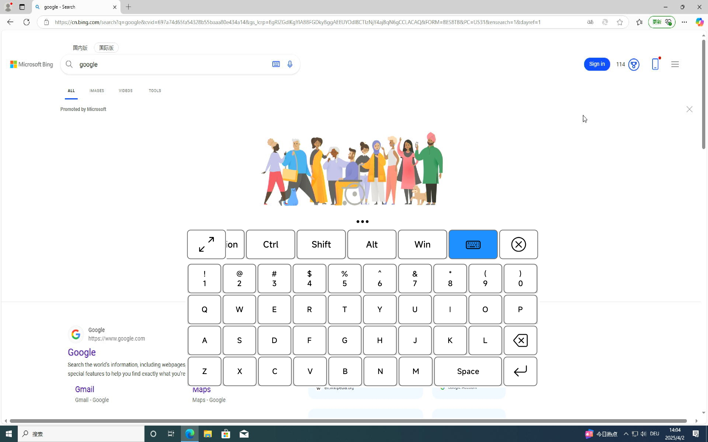

# Openterface Android

## Overview

Openterface Mini-KVM is an open-source hardware and software solution designed to provide basic KVM (Keyboard, Video, Mouse) functionality for controlling devices via an Android-based interface. This repository contains the Android application source code, build configurations, and supporting scripts to set up and deploy the project.

We are committed to open hardware and open-source software, licensed under the [GNU Affero General Public License v3](LICENSE).

## Feature Modules

### 1. Video Display

#### Main Functionality

-   Streams video output from the connected target device to the Android screen in real-time.
-   Supports image adjustments for optimal viewing.

#### User Interface Description

-   The main screen displays the target device's video feed, occupying most of the interface.
-   A toolbar at the side provides adjustment controls (brightness, contrast, hue).

#### Operation Flow

1. Connect the Mini-KVM hardware to the target device via HDMI and USB.
2. Plug the Mini-KVM into your Android device via USB-C.
3. Launch the app; the video feed appears automatically.
4. Use the toolbar sliders to adjust brightness, contrast, or hue as needed.

#### Special Features

-   Pair-finger zooming makes the display look better

---

### 2. Mouse Control

#### Main Functionality

-   Provides absolute and relative mouse control to interact with the target device’s interface.
-   Supports left and right clicks.
-   Select mode from the right menu.

#### User Interface Description

-   The video feed doubles as a touchpad for mouse input.
-   A floating action button (FAB) toggles between mouse and keyboard modes.

#### Operation Flow

1. Make sure the device is connected successfully.
2. Tap the screen to move the mouse cursor to that position (absolute control).
3. Double-click with one finger for left click, Two-finger click for right click.
4. The drag mode is to hold down the left button without releasing it.

#### Special Features

-   Relative mouse control (in development, toggle via settings when available).

## 

### 3. Keyboard Input

#### Main Functionality

-   Type into the device by clicking keyboard keys.

#### User Interface Description

-   The keyboard icon is in the lower right corner.
-   The keyboard includes shortcut keys, system keys, standard keys and function keys (F1-F12).

#### Operation Flow

1. Click the keyboard icon in the lower right corner to bring up the keyboard.
2. Type text or press function keys as needed.

#### Special Features or Shortcuts

-   **Shortcuts Keys**: Ctrl+C、Ctrl+V、Ctrl+Z、Ctrl+X、Ctrl+A、Ctrl+S、
    Win+Tab、Win+S、Win+E、Win+R、Win+D、Win+L、Alt+F4、Ctrl+Alt+Del、Alt+PrtScr.
-   **Function Keys**: F1-F12、Symbol Keys.
-   **Standard keys**: 0-9、A-Z、Enter、Space、delete.

---

In the meantime, feel free to explore our open-source **GitHub repository**: [Openterface_Android](https://github.com/TechxArtisanStudio/Openterface_Android) for the latest code, updates, examples, and to report issues.

You can also join our [Discord community](/discord) to connect with our dev team and other awesome users to discuss any KVM-related topics.

For direct support, feel free to email us at [support@openterface.com](mailto:support@openterface.com).
