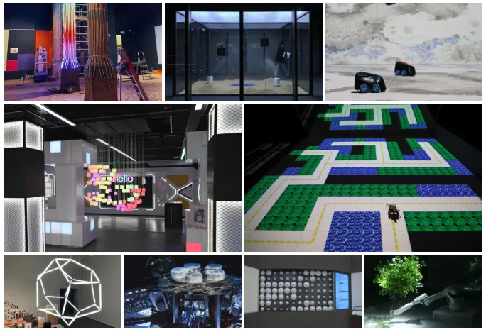
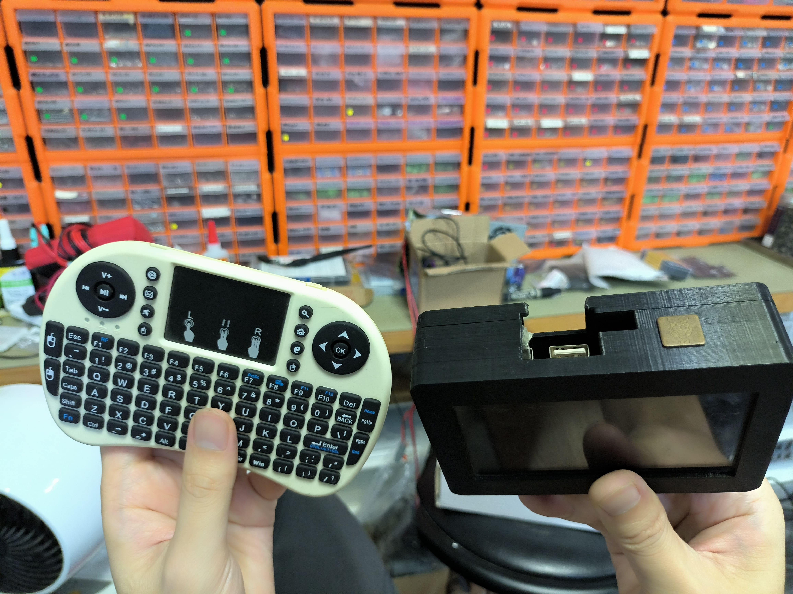
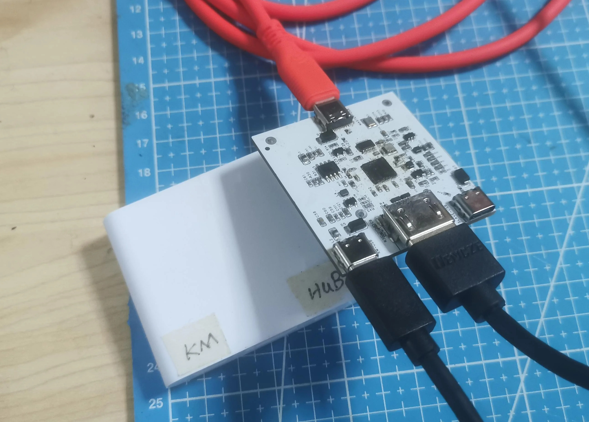
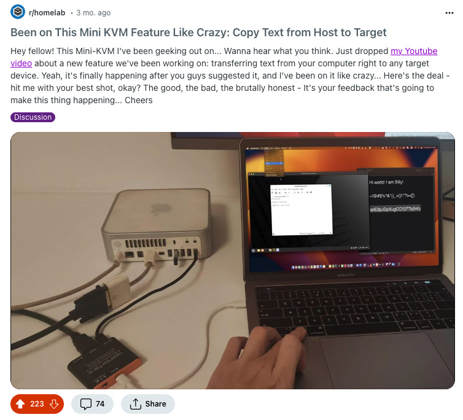
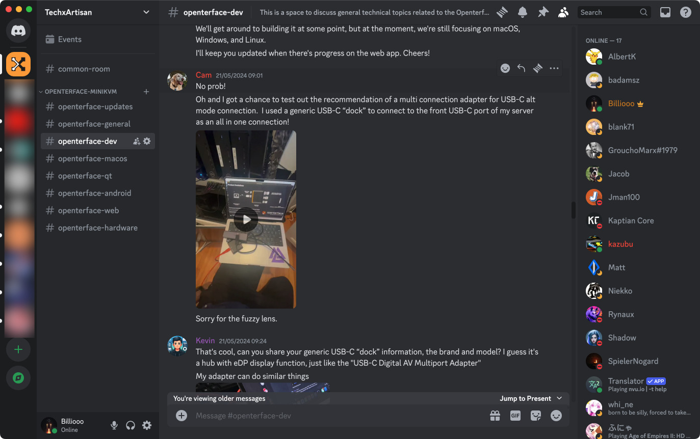

# Casual Chat with David Groom from MAKE: Magazine: The Story of Openterface Mini-KVM 🎙️

Hi everyone!
s
We just wrapped up an awesome [YouTube livestream](https://www.youtube.com/live/lwitzvmxsgc?si=s9a1t5_Sce5v22e1) with David Groom from MAKE: Magazine! During the session, we delved into the story behind our Openterface Mini-KVM, an innovative open-source hardware solution designed to effortlessly control headless devices and single-board computers like Raspberry Pis using just your laptop. You can check out the YouTube livestream for more details or simply read the story below.

<!-- more -->

## The Birth of an Idea

The journey of the Mini-KVM began in the bustling city of Guangzhou, China, within our TechxArtisan studio. Over the past five years, we have been deeply involved in numerous tech art projects for local and international artists. Our work includes constructing interactive lighting installations with AI detection, robotic arms for theatre performances, self-driving mini cars that solve random mazes, and even a robot dog designed to explore no man's lands like deserts and forests.

### A Common Headache
A recurring challenge in our work was managing a plethora of headless computers like Raspberry Pis and Jetson Nanos, which lacked monitors, keyboards, or network connectivity. This often led to frantic searches for spare monitors and keyboards to troubleshoot and access these devices in harsh conditions.

### Makeshift Solutions
Initially, we resorted to makeshift portable monitor solutions powered by battery packs and wireless mini-keyboards with touchpads. However, these were often forgotten or misplaced, prompting the need for a dedicated hardware solution that could leverage the laptops we always carried for coding and setup.

*These two gadgets must be carried for on-site projects.*

### The First Prototype
Our first DIY prototype was a simple yet effective combination of a capture card to retrieve video from the headless device and a USB keyboard/mouse simulator, all integrated into a single USB cable connecting to our laptops. 

*One of the early versions of the mini-KVM PCB*

We showcased our cool tech art projects at the Shenzhen Maker Faire in November 2023, intending to show off the mini-KVM prototype to David. However, we got so excited about the gifts from David and forgot it!

*Stickers and postcards from MAKE: Magazine are seriously cool!*

## Community Feedback and Development
After sharing our prototype on Reddit, we received invaluable feedback from [the community](http://openterface.com/community/#community-contributors), encouraging us to refine and develop our solution into a polished product. This community support was instrumental in transforming our makeshift device into a sleek, efficient tool for homelabbers, sysadmins, tech enthusiasts, and anyone working with headless computers.

*Received a super amount of feedback from homelabbers*

## Overcoming Doubts
Despite initial doubts about competing with existing similar solutions, the positive response and constructive suggestions from online communities helped clarify potential use cases and boosted our confidence. Without this support and affirmation of our efforts, we might not have pursued the project further.

## Crowdfunding and Future Plans
The crowdfunding campaign for the Openterface Mini-KVM on Crowd Supply is picking up serious steam, with about two weeks left to go. This campaign isn't just about developing the Mini-KVM; it's a testament to the power of community-driven innovation. Next up, we'll dive into production management, software improvements, and getting this handy gadget delivered to our awesome backers—all powered by our amazing open-source community.

*Beta testers are sharing their use of the Openterface Mini-KVM in their daily tech tasks on TechxArtisan's Discord*

## Embracing the Open-Source Vision

The Openterface Mini-KVM is a testament to our creativity and perseverance, and the supportive open-source community. What began as a simple solution for our personal challenges has evolved into a versatile, open-source tool poised to benefit hackers, tinkerers, and tech enthusiasts worldwide. Stay tuned for more updates as the Mini-KVM moves closer to its official release!