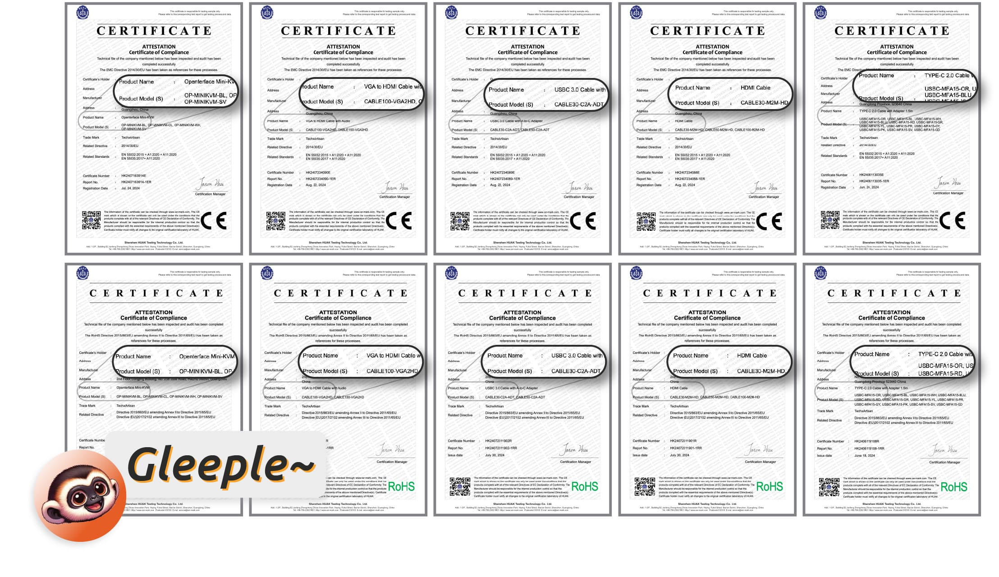
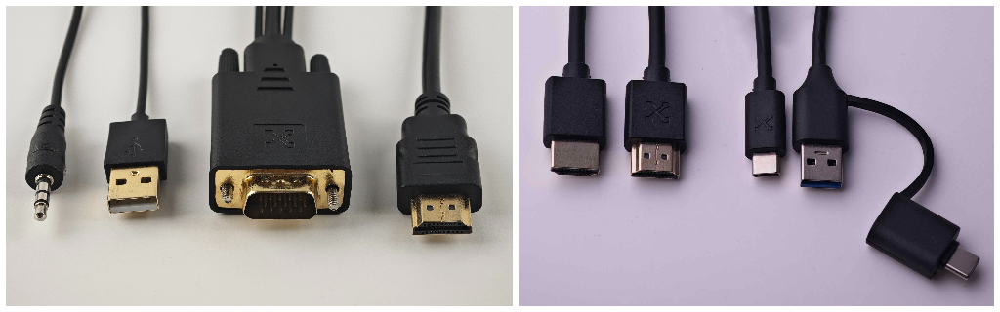
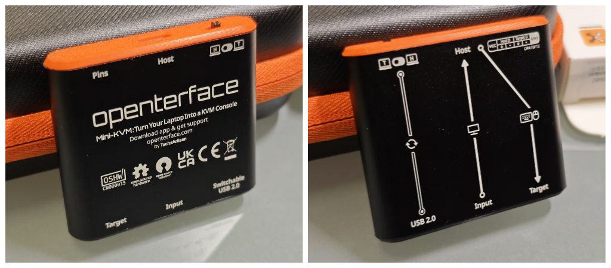

# Overcoming Hurdles: Progress Update & New Timeline

Hey everyone,

I hope you’re all doing well. It’s been a while since our last update. I wish I could say everything’s been smooth sailing for Openterface, but we’ve hit a couple of speed bumps that will delay our delivery timeline. While this wasn’t what we expected, we’re tackling these challenges head-on and making steady progress with plenty of good news to share. This post is about **a 7-minute read**, so let’s dive into the details so you know exactly where things stand and what’s coming next.

## Regulation, Production, and Quality

Before we could kick off production, we had to pass necessary quality tests according to regulations, particularly CE certification. Since our toolkit version includes not just the Mini-KVM but also several accessories, each part needed to undergo CE testing. These tests took longer than expected (turns out cables can be quite picky), but the great news is that **we’ve passed CE for our Mini-KVM and all its components!** Below is an overview of the certifications for all our parts: Mini-KVM, HDMI cable, orange Type-C cable, black short Type-C cable, and VGA2HDMI cable. With certification in hand, our production timeline is now certain, and our manufacturers are **currently producing all parts** as I speak.

*UKCA and CE requirements are the same for our electronic products, with CE also covering RoHS compliance.*

Two weeks ago, we visited one of our manufacturers to train their line managers on quality control for the orange cables before they shipped them to us. Now, ALL the orange cables have been produced and are sitting in a corner of our studio.

*Kevin and Shawn were explaining the testing methods to ensure the orange cable works properly with our Openterface Mini-KVM.*

We will do the same task in this week to train QA at the production frontline for other parts as well. Here are samples of additional cables.

*Proudly marked with our TechxArtisan logo, these are samples of the HDMI cable, the short Type-C cable, and the VGA-to-HDMI cable.*

We’re expecting the other parts and Mini-KVMs to arrive soon from our manufacturers, at which point we’ll double-check the quality of every component and pack them properly at our studio before shipment. In other words, **our team will personally ensure the quality** before it reaches your hands.

## Shipment, Potential Delays, and New ETA

**The current uncertainty lies in the shipment process**. After investigating several shipping companies, we found that shipping will take extra time as we will likely transfer parcels through a warehouse before reaching Crowd Supply’s warehouse. We’re still debating whether to choose sea or air freight—please bear with us for a few more days while we sort out the arrangements.

Customs clearance is another potential hurdle that might cause unexpected delays. Once our products arrive at Crowd Supply's warehouse in the US, they’ll take one to two weeks to ship out globally based on each order. For backers outside the US, individual parcels will still need to go through global shipping and customs clearance in the destination country.

Accounting for the current situation and adding some buffer time, I remain cautiously optimistic that we’ll complete delivery before the end of this year, with **a new ETA of mid-January**. I’m truly sorry for the inconvenience and appreciate your support and patience during this change.

## Finalised Hardware V1.9

As you may know from our previous [Reddit post](https://www.reddit.com/r/Openterface_miniKVM/comments/1e25pco/openterface_minikvm_v19_with_pins_for_more/), we decided to **upgrade our hardware to V1.9**, including a set of hackable expansion pins. This wasn’t part of the original plan for the crowdfunding campaign, but we believe it significantly enhances the hardware’s **potential for broader use**.

*The VCC, GND, Target D+, Target D-, Host D+, and Host D- pins—where ‘D’ stands for USB data.*

One key motivation was to enable **the USB switch to be toggled at the software level**. Why is this important? On our roadmap, we **aim to support a KVM-over-IP solution**, such as VNC, in the future. The idea is to match local KVM control with the VNC protocol, allowing users to remotely control the target computer via the host computer. In such a remote scenario, the ability for users to switch the USB port is essential, especially when file transfers between the host and target are required.

**The expansion pins also open up possibilities for more**, like integrating with iPadOS, ATX control, network bridging, and audio bypass. While I won’t dive into all the details here, I encourage you to join our Openterface community to discuss with us further.

This hardware upgrade could potentially extend our Openterface solution to operate over IP and include more advanced features while still maintaining its core strength as a plug-and-play KVM-over-USB tool—perfect for IT pros navigating uncertain IT environments, like unfamiliar data centres.

I’m happy to report that V1.9 has passed our internal basic tests and will be finalised as the official version for all our backers. However, this hardware upgrade will require further testing, and any development based on these expansion pins will be experimental and likely to have bugs. This is where you can contribute. We’re counting on the open-source community to help us improve Openterface together.

## More Software Updates

On the software front, we’re making exciting strides. We’re diving into the **Openterface Android app** now! Check out this [tweet](https://x.com/TechxArtisan/status/1825460088922071398) for an early demo showing smooth KVM control, mouse movement, and clicks in action. More features are on the way, and as always, once we’ve polished the code a bit more, **this app will also be open-sourced** on our GitHub repo [Openterface_Android](https://github.com/TechxArtisanStudio/Openterface_Android).

*Using just our fingertips to KVM control a Linux computer from an Android tablet. Nice!*

Our QT version just got a handy update—you can now [transfer text from the host to the target](https://x.com/TechxArtisan/status/1825919721960780131)! So now this feature is supported on macOS, Windows, and Linux host apps.

Moreover, We’re also planning to add a fun feature — [an auto mouse movement to prevent your target computer from sleeping](https://x.com/TechxArtisan/status/1825471186668847241). Should we go with the ping-pong ball bouncing around the screen or the classic DVD screensaver effect? Vote and comment the [tweet](https://x.com/TechxArtisan/status/1825470086800691459) 😃

## Package Design, Labelling, and Manual

We’ve been [experimenting with various mock-ups and packaging designs](https://www.reddit.com/r/Openterface_miniKVM/comments/1elm4vq/almost_ready_to_finalize_our_package_design/) to find the perfect balance among several key factors:

- Selecting materials sturdy enough to protect the product and its parts during shipment,
- Creating informative labelling that helps users understand the product at a glance,
- Ensuring compliance with regulations,
- Making the packaging visually appealing,
- And being eco-friendly by minimising plastic use wherever possible.

Additionally, we’ve made several improvements to the old toolkit bag, including:

- Larger storage space,
- A stylish orange zipper,
- Upgraded exterior and interior materials,
- And a super stretchy mesh pocket.

We chose this material because it strikes the ideal balance between being budget-friendly, pleasant to the touch, and durable enough to protect the items inside. **We’re confident you’ll love it**.

We’re also updating the labels on the aluminium casing to make them as informative and visually appealing as possible. We hope these enhancements will improve your user experience and make it easier to get started with Openterface.

We’re finalising the Openterface manual, which will be available in English, German, French, Japanese, and Chinese. Apologies if we missed your language—our box isn’t TARDIS-sized (Doctor Who’s police box)! But we’ll do our best to add more translations on our website.

## Community Language Review

I’ve been using ChatGPT to assist with translations, but it can sometimes miss the mark with phrasing and wording. If it’s not too much trouble, I’d greatly appreciate any help in reviewing the content in other languages, especially for the printed materials we’re about to finalise. I’ve updated all the text content for the packaging in our GitHub folder [product-printed-materials](https://github.com/TechxArtisanStudio/Openterface/tree/main/product-printed-materials), where you can review and submit any improvements. You can also DM me directly. Thanks!

## Final Remarks and Ongoing Progress

We apologise again for the delays and the change in our product’s ETA. Thank you for your patience and for sticking with us—we’re working hard to get this to you as soon as possible! I’ll update you immediately once our shipment is arranged. More updates are on the way, so please join our Openterface community and stay tuned!

Cheers,

Billy Wang  
Product Manager  
Openterface Team | TechxArtisan