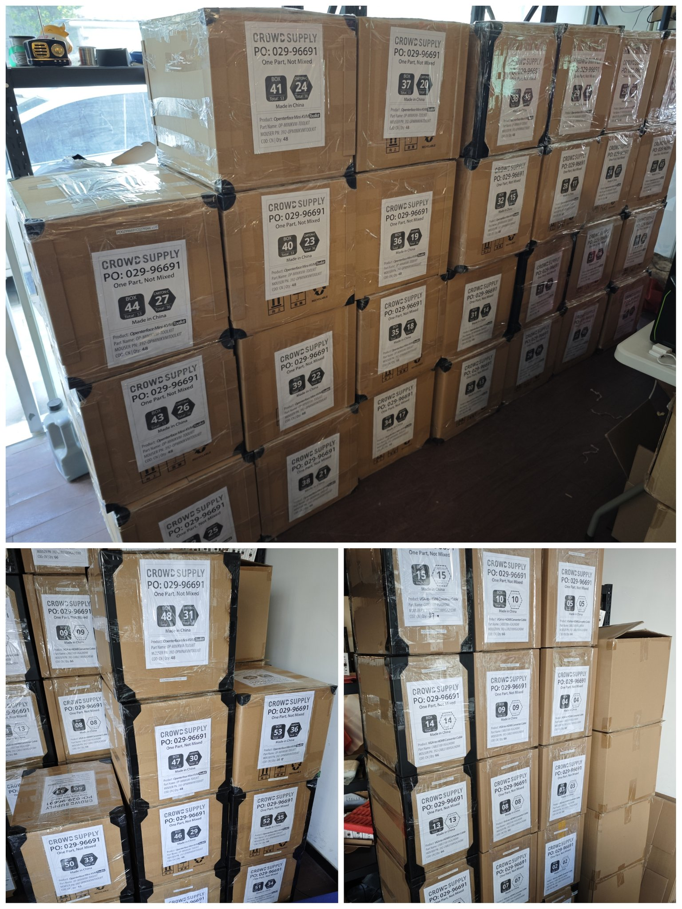
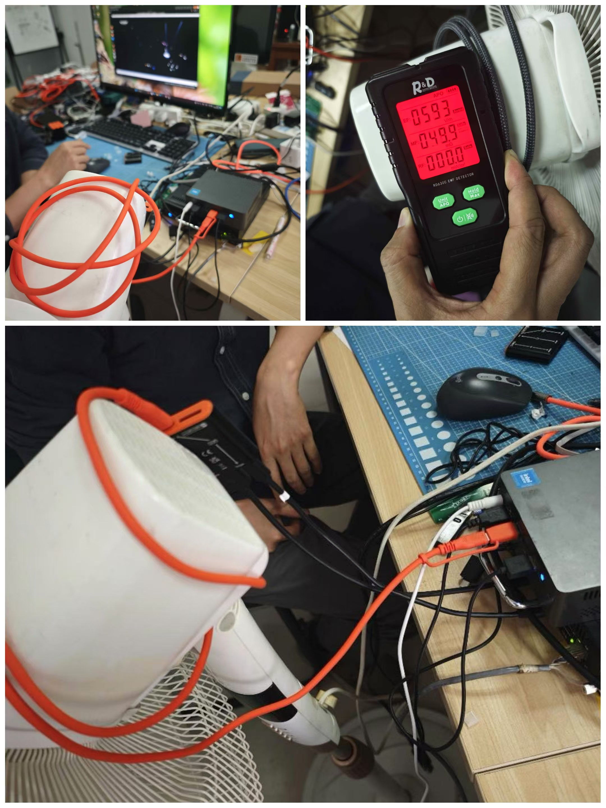

# The Ship Has Sailed, and We’ve Added Extra Cables for the Toolkit. What’s Next?

Hello, Openterface community!

We’re thrilled to announce that our Openterface products have officially shipped. They’re currently at the port in Shenzhen, ready to board a cargo ship bound for the US!

Here’s what’s new:

## Fulfillment Preparations: Quality Checks and Packing

Before shipping, we thoroughly tested each unit to ensure the highest quality. Every cable was scrutinised for signal transmission stability using our Mini-KVM.

Now, let’s talk about the news—both the bad and the good.

### BAD News: Some Orange Cables Didn’t Meet Expectations Under Tough Conditions

Our Mini-KVM transmits video, audio, mouse/keyboard control, and USB data via a single Type-C cable. The cable’s performance is critical for data stability, especially in challenging environments.

To simulate real-world interference, we wrapped the orange Type-C cable around an electric fan motor while running multiple computers nearby. This created a high level of electromagnetic interference (EMI), to evaluate our cables’ data transmission stability.

*A budget-friendly yet effective testing method.*

Under these conditions, some orange cables struggled with signal loss, raising concerns about their reliability in complex environments such as data centres or during critical IT operations.

To address this, Kevin Peng, our tech director, developed a bespoke testing programme. This tool will soon be open-sourced, allowing you to test the quality of your own USB cables.

*Our programme makes cable testing a breeze.*

While our orange cables, with its soft, silicone-like texture and attractive appearance, are great and are perfect for everyday use like fast charging and regular data transmits, they fall short in a heavy transmits work in tough conditions, like high EMI.

### GOOD News: Our Solution is Here

We’ve immediately sourced high-quality nylon USB 3.2 cables to include as an extra in the Toolkit version—**at no additional cost** to you. These durable cables come in three lengths in grey color: *1M (3.2 ft)*, *1.5M (4.9 ft)*, and *2M (6.5 ft)*. You’ll receive one randomly selected cable from these length options in your Toolkit version, ensuring you have a robust and reliable connection for your Mini-KVM.

In future Mini-KVM Toolkit versions, our orange cable for connecting to the host side of Mini-KVM will be upgraded to the nylon Type-C 3.2 cable, combining functionality, stability, and style.

We hope you appreciate this decision and continue to rely on Openterface during critical moments on your tech frontlines.

------------------

## Shipping Schedule
When can you expect your Mini-KVM?
If everything goes smoothly with our shippment, our products should arrive at Crowd Supply’s **Mouser warehouse by mid-December**, then they will get our Openterface shipped out according to each orders accordingly.

- **For backers in the US**: there’s a small chance for delivery before Christmas, but this isn’t guaranteed, since everything tends to slow down as the holiday gets closer.

- **For backers outside the US**: Delivery times will vary. Our best estimate is mid-January.

Here’s hoping for a smooth journey for our Openterface products—no seasickness, carsickness, or jet lag! (laughs)

## Cool Openterface T-Shirts and Hoodies

We’ll be at the Shenzhen Maker Fair this weekend (16–17 Nov). To gear up, we’ve designed team apparel, including T-shirts and hoodies.

Take a look and let us know what you think: [image].

## Support Our Development

If you’d like to support us further, check out our [TechxArtisan Shop](shop.techxartisan.com). You can purchase cables, T-shirts, and hoodies—all while helping us continue to innovate. Every purchase counts and supports the open-source community spirit.

## What’s Next: Host App Updates

Now that shipping is underway, our focus will shift back to refining our host apps. We’re working on getting them verified across various app stores to ensure a seamless experience as you get started with Openterface.

Thank you for being an integral part of our journey. Your support and feedback keep us moving forward. If you have any questions or ideas, we’d love to hear from you! Join the conversation in our community on [Reddit](https://openterface.com/reddit) and [Discord](https://openterface.com/discord).

With gratitude,  
Billy Wang  
Product Manager  
Openterface Team | TechxArtisan