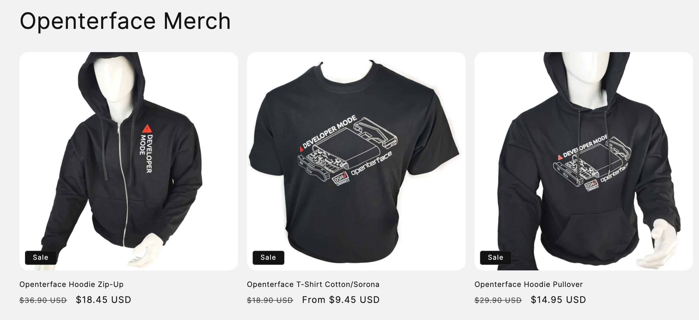
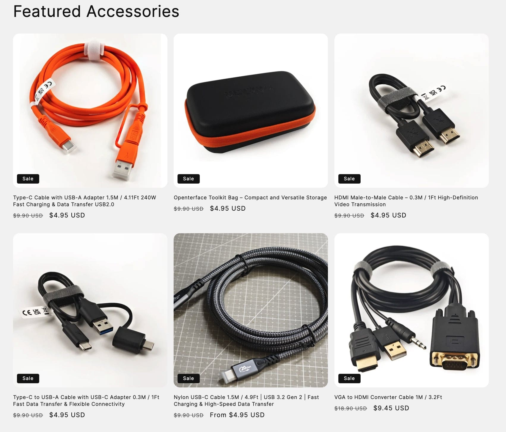

# 50% OFF on ALL Merchandise – Only This Black Friday! Show Your Support for Open Source!

Hey dear Openterface folks,

Exciting news—we’ve launched **a new clothing line** at Openterface! Our collection features T-shirts and hoodies that embody the spirit of our community. They’re not just clothes; they’re a celebration of our shared values and the Openterface ethos.

What makes these designs even more special? Both the T-shirt and hoodie proudly feature the **technical line art of our Openterface mini-KVM**, which looks incredibly cool. Plus, we’ve highlighted our mini-KVM’s **“Developer Mode”** text in the design—an idea we think is absolutely brilliant. When you put on our T-shirt or hoodie, it’s not just about staying warm this winter; it’s about stepping into super developer mode for all your coding and hacking sessions.

And if you’re wondering how these look in real life, check out how our team’s been wearing them in action! From staying cosy in **Developer Mode** while coding ([see tweet](https://x.com/TechxArtisan/status/1861611266705379346)), to a fun photoshoot with David Groom from **MAKE: Magazine** at the Shenzhen Maker Faire ([view photo](https://pbs.twimg.com/media/Gcp8E32agAAEnl-?format=jpg&name=large)), we’ve been proudly showcasing our gear. We even got inspired by a talk from the legendary Eric Migicovsky of Pebble fame ([see post](https://www.linkedin.com/posts/billy-wangrb_had-an-incredible-weekend-at-shenzhen-maker-activity-7264123680803233792-l7Mm?utm_source=share&utm_medium=member_desktop)) while demoing the Openterface Mini-KVM and connecting with tech friends ([see more](https://twitter.com/TechxArtisan/status/1858397377196965913), [and here](https://twitter.com/TechxArtisan/status/1858400923325726750)). These aren’t just clothes—they’re conversation starters and a way to celebrate our community wherever we go!  

And for this dull winter, why not give our vibrant orange data cable a chance? It’s a perfect way to brighten your workspace while ensuring fast and reliable data transfer.

To sweeten the deal, we’re offering a 🔥 SPECIAL 50% DISCOUNT 🔥 on all items for the next five days for this **2024 Black Friday**, starting from the moment you see this message until December 1st. It’s our way of saying thanks for being part of our journey.

Have a browse through our store here: **[https://shop.techxartisan.com](https://shop.techxartisan.com)**. Check out our new apparel and snag a piece at half price—don’t miss this limited-time offer!

Thank you for being with us through this adventure. Your support means the world to us, and we’re grateful for every conversation, every idea, and every interaction we’ve had.

Warm regards,

**Billy Wang**  
Product Manager  
Openterface Team | TechxArtisan  

**P.S.** Got any thoughts or feedback? We’re all ears! Join the conversation on [Reddit](https://openterface.com/reddit) or [Discord](https://openterface.com/discord), or feel free to drop us an email at **info@techxartisan.com** ✉️.