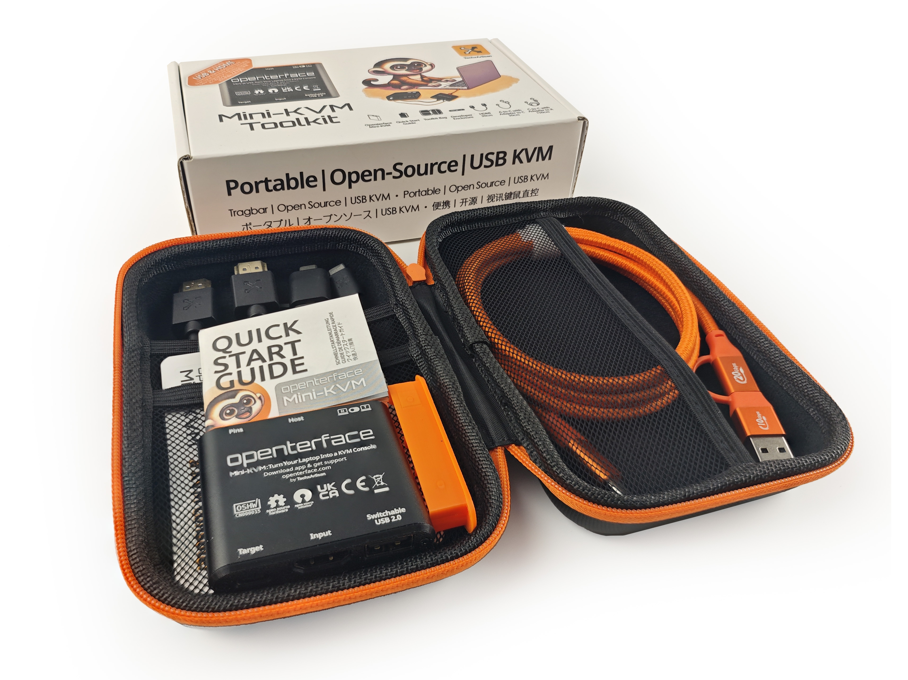

# Clear Backlog, Fresh Gear, and More Time to Build USB KVM!

**Hey there, Openterface fam!**

It’s been a while, and we’ve got some exciting news to share! Let’s dive in!

### Your Unboxings, Our Biggest Motivation

More and more backers are receiving their kits and sharing their experiences with unboxings, setups, and creative use cases. We’ve seen incredible unboxing posts across popular platforms like Discord, Reddit, Mastodon, Bluesky, Threads, X—you name it!

Honestly, we know we’ve mentioned this in previous posts, but we can never say it enough—our gratitude runs deep. Seeing your enthusiasm and how our gadget helps you at the tech frontline is exactly what we built this for and fight for, and it’s truly an honor. Your shares and feedback are the greatest validation of our hard work.

Thank you, Openterface fam! 🚀💙

### **Backlog Cleared & Fully Stocked**

According to Crowd Supply, most orders have already shipped! If you haven’t received yours yet, double check your shipment information of the order and it’s likely being processed and should be on its way soon. Feel free to [reach out to Crowd Supply](https://www.crowdsupply.com/contact) for updates on your order status.

Additionally, we recently shipped another batch of Openterface Mini-KVM units, and Crowd Supply’s Texas warehouse is now fully stocked! So, if your current Mini-KVM is proving invaluable for managing your headless devices at your tech frontline, consider [grabbing another via Crowd Supply](https://www.crowdsupply.com/techxartisan/openterface-mini-kvm)—or spread the word to your tech-loving friends!

### **Bugs? No Problem! Dev Team in Action**  

The buzz on our Reddit, Discord, and GitHub has been awesome! Your feedback, questions, and issue reports have been rolling in—and we’re so grateful for it.

Here’s what our dev team is focused on right now:

- **Fixing Bugs:** Squashing those pesky issues you’ve reported.  
- **Supporting You:** Updating our docs and FAQs to make your experience smoother.  

We’re reviewing every issue, holding regular check-ins, and squashing bugs one by one. Making the app more solid and reliable is our top priority—and your input is key to making that happen.  

Got a bug to report or found a cool way to use your Mini-KVM to save the day? We’d **love** to hear about it! Whether it’s a creative setup, a must-have feature idea, or just pure excitement—we’re all ears.  

To help our dev team track bugs systematically (and keep their sanity intact), we **strongly recommend** reporting them on our GitHub repos first:

- [Openterface QT](https://github.com/TechxArtisanStudio/Openterface_QT) for Windows & Linux
- [Openterface MacOS](https://github.com/TechxArtisanStudio/Openterface_MacOS)
- [Openterface Android](https://github.com/TechxArtisanStudio/Openterface_Android)
- [Openterface Mini-KVM Hardware](https://github.com/TechxArtisanStudio/Openterface_Mini-KVM_Hardware)

Prefer real-time discussions with the dev team and fellow Openterface fans? Join our awesome community:

- **Reddit:** [r/Openterface_miniKVM](https://openterface.com/reddit)  
- **Discord:** [Openterface](https://openterface.com/discord)  

Oh, and if you like keeping things old-school, you can always **email us** at info@openterface.com or drop us a message via our **Google Form**: [Submit Feedback](https://forms.gle/enVJYFGn6gghEFaJ9).  

Your patience and support mean the world to us as we work through any bumps along the way. Huge thanks to everyone who has reported issues, shared ideas, and even jumped in to contribute code! The Openterface device isn’t perfect (yet!), but trust us—with this community’s energy, it’s getting better every day. 🚀💙  

### **DIY KVM Challenge: Extended & Upgraded Prizes!**

Since our kits were shipped later than expected, we’re extending the DIY KVM Challenge by **two months**! Plus, we’re upgrading the prizes—stay tuned for details on the Crowd Supply contest page. That means more time to tinker, experiment, and showcase your builds. Join the fun and submit your projects via Crowd Supply’s USB DIY Contest page: [USB KVM DIY Challenge 2024](https://www.crowdsupply.com/techxartisan/usb-kvm-diy-challenge-2024)

### **New Bright Orange Nylon Cable**

With our latest Mini-KVM batch, we’ve officially upgraded the Type-C cable in our toolkit version to the new bright orange nylon cable. This new cable isn’t just visually striking—it’s built for performance, with superior EMI resistance, stable data transfer, and exceptional durability.

But if you prefer the softer, more flexible feel of the original silicone-like Type-C cable, no worries! You can still grab them from our [TxA Shop](https://shop.techxartisan.com/products/type-c-cable-with-usb-a-adapter-1-5m-4-11ft-240w-fast-charging-data-transfer-usb2-0). Both cables have their strengths, and we’re confident the new nylon version will be a solid addition to your tech toolkit.

### **Seamless Control: Mini-KVM + Android Pencil = Pure Magic**

Ever wondered what happens when you [pair the Mini-KVM with an Android Pencil](https://www.reddit.com/r/Openterface_miniKVM/comments/1hnh79n/kicad_is_the_fisrt_software_we_tried_first_with/)? Pure magic! From sketching designs to navigating macOS or Window, the experience of our [Opoenterface Android host app](https://github.com/TechxArtisanStudio/Openterface_Android) is smooth, intuitive, and satisfying. Check out our demo video to see it in action!

### **Awesome Use Cases from the Community:**

Here are just a few more ideas of how you can use the Openterface Mini-KVM:

- **Headless Control with Android Phone:** [My Pi 5 setup: UPS, Aluminium Case, & Openterface Magic](https://www.reddit.com/r/Openterface_miniKVM/comments/1hrx1j5/my_pi_5_setup_ups_aluminium_case_openterface_magic/)
- **Reviving a Broken MacBook:** [Uh... A way to save the day of this pink screen!](https://www.reddit.com/r/macbookpro/comments/1hwkh64/uh_a_way_to_save_the_day_of_this_pink_screen/)
- **Explore more use cases** on our [website](https://openterface.com/use-cases/).

Your creativity and passion are the heart of the Openterface community. 

In the meantime, be sure to explore our [TechxArtisan Shop](http://shop.techxartisan.com/) for Openterface merch and high-quality cables designed to work seamlessly with your Openterface devices. 

Until then… happy tinkering!

With gratitude,  
Billy Wang  
Product Manager  
Openterface Team | TechxArtisan