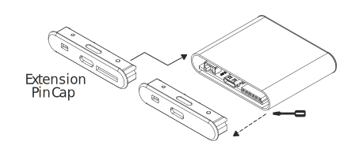
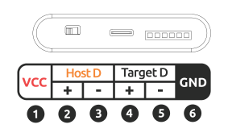

# Open Hardware

{:style="max-height:400px"}

## Explore Hardware Details

- [Openterface_Mini-KVM_Hardware](https://github.com/TechxArtisanStudio/Openterface_Mini-KVM_Hardware): Explore our comprehensive hardware design, schematics, and components.

## OSHWA Compliance

{:style="height:120px"}
{:style="height:100px"}

Our Openterface Mini-KVM is proudly certified by the **Open Source Hardware Association** (OSHWA). This OSHWA certification ([**UID CN000015**](https://certification.oshwa.org/cn000015.html)) confirms our commitment to the principles of open hardware, ensuring that all design files, documentation, and source code are freely available for study, modification, distribution, and manufacture.

## Extension Pins for Development

{:style="max-height:300px"}

The Openterface Mini-KVM features extension pins for advanced development and [Open Software](/app) experimentation. These pins are not exposed in the standard case configuration.

### Accessing Extension Pins

To access the extension pins:

1. Disassemble the device
2. Replace the original case cover with a specialized Extension Pin Cap
3. Download the 3D model for the Extension Pin Cap from our [GitHub repository](https://github.com/TechxArtisanStudio/Openterface_Mini-KVM_Hardware)

!!! warning "Warranty Void"
    Removing the original case voids the product warranty. All modifications or disassembly are undertaken at the user's own risk.

!!! note "Experimental Features"
    Features developed using these pins are experimental and have not been fully tested. Openterface is not liable for any damage, injury, or malfunction resulting from modifications, exposure of the extension pins, or other alterations to the device.

### Pin Layout

{:style="max-height:200px"}
{:style="max-height:200px"}

The extension pins provide the following connections:

1. USB 5V Power supply for external components
2. Data positive to the USB hub of the host
3. Data negative to the USB hub of the host
4. Data positive to the USB hub of the target
5. Data negative to the USB hub of the target
6. Ground

!!! danger "Incorrect Connections"
    Mixing up VCC and GND can cause severe damage to the device and connected components. Always double-check pin connections before powering the device.

## Join the Development Fun

We're excited to explore the potential of these extension pins, and we invite you to join us in this adventure! As we continue to develop and experiment, we'll be updating this section with more information about what these pins can do and how they can be used creatively.

### Coming Soon
- Detailed pin functionality explanations
- DIY project examples showcasing innovative uses of the extension pins
- Community-contributed ideas and implementations

### Get Involved
1. **Share Your Ideas**: Have a cool concept for using these pins? We'd love to hear it!
2. **Contribute DIY Projects**: If you've created something interesting, consider sharing it with the community.
3. **Join the Discussion**: Connect with other developers and enthusiasts to brainstorm and collaborate.

Stay updated and participate in discussions about extension pin development on our [Discord community](/discord) or [Reddit](/reddit).

Your creativity and expertise can help push the boundaries of what's possible with the Openterface Mini-KVM. Let's innovate together!

