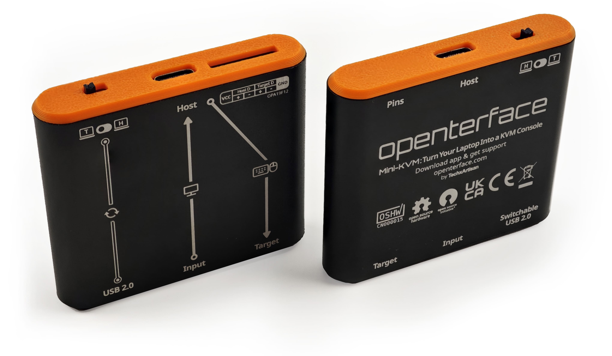

# Open Hardware

{:style="max-height:400px"}

## Explore Hardware Details

- [Openterface_Mini-KVM_Hardware](https://github.com/TechxArtisanStudio/Openterface_Mini-KVM_Hardware): Explore our comprehensive hardware design, schematics, and components.
- [Extension Pins ](pin.md): Learn about accessing and using the extension pins for advanced development and experimentation.

## OSHWA Compliance

{:style="height:120px"}
{:style="height:100px"}

Our Openterface Mini-KVM is proudly certified by the **Open Source Hardware Association** (OSHWA). This OSHWA certification ([**UID CN000015**](https://certification.oshwa.org/cn000015.html)) confirms our commitment to the principles of open hardware, ensuring that all design files, documentation, and source code are freely available for study, modification, distribution, and manufacture.

## Join the Development Fun

We're excited to explore the potential of its hardware and these extension pins, and we invite you to join us in this adventure! As we continue to develop and experiment, we'll be updating this section with more information about what these pins can do and how they can be used creatively.

### Coming Soon
- Detailed pin functionality explanations
- DIY project examples showcasing innovative uses of the extension pins
- Community-contributed ideas and implementations

### Get Involved
1. **Share Your Ideas**: Have a cool concept for using these pins? We'd love to hear it!
2. **Contribute DIY Projects**: If you've created something interesting, consider sharing it with the community.
3. **Join the Discussion**: Connect with other developers and enthusiasts to brainstorm and collaborate.

Stay updated and participate in discussions about extension pin development on our [Discord community](/discord) or [Reddit](/reddit).

Your creativity and expertise can help push the boundaries of what's possible with the Openterface Mini-KVM. Let's innovate together!
