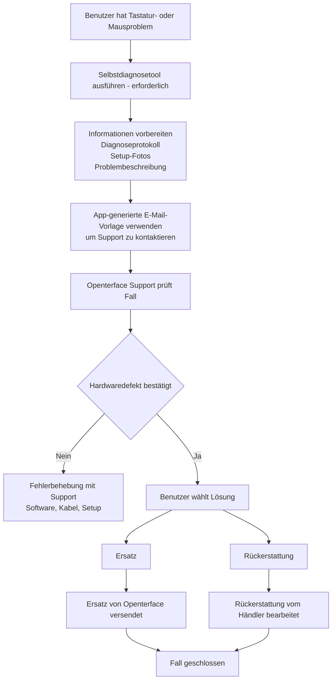

# Probleme mit dem Mini-KVM? Hier starten
*Support- und Fehlerbehebungsanleitung*

## Wir sind für Sie da

Wir verstehen, wie frustrierend es sein kann, wenn ein Gerät nicht wie erwartet funktioniert — besonders wenn Sie es unbedingt nutzen möchten.

Diese Seite erklärt **was Sie als Nächstes tun sollten**, **wie wir helfen** und **was Sie erwarten können**, wenn Ihr Mini-KVM Tastatur- oder Maussteuerungsprobleme hat.

Unser Ziel ist es, **klar, ruhig und fair** zu sein und sicherzustellen, dass jeder betroffene Benutzer ordnungsgemäß betreut wird.

## Warum das passieren kann

**Eine kleine Anzahl von Mini-KVM-Einheiten aus einer bestimmten früheren Produktionscharge** kann unter bestimmten Bedingungen intermittierende Tastatur- oder Mausinstabilität zeigen.  
Die meisten Einheiten, einschließlich früherer und späterer Chargen, funktionieren normal.

Wichtige Punkte:

- Es betrifft **nur eine Teilmenge der Geräte**, nicht alle Mini-KVMs
- Es **stellt keine Sicherheitsrisiken dar** und **verschlechtert sich nicht mit der Zeit**

Wir haben die Ursache identifiziert, die QA für spätere Chargen verbessert und **Selbstdiagnosetools** hinzugefügt, um betroffene Geräte schnell zu identifizieren.

Für mehr Hintergrund und technischen Kontext siehe:

- [Tastatur und Maus können den Zielcomputer nicht steuern](/product/minikvm/support/keyboard-mouse-control/)
- [Tastatur- und Mausproblem – Technische Analyse](/product/minikvm/updates/260128-keyboard-mouse-issue-analysis/)

Wenn Ihre Einheit betroffen ist, verpflichten wir uns, sie verantwortungsvoll zu lösen.

## Überblick — Wie dies gehandhabt wird

## Schritt 1 — Selbstdiagnose ausführen (**Erforderlich**)

Die Ausführung des Selbstdiagnosetools ist **kritisch**.
Es ermöglicht uns, den Gerätezustand zu verstehen und Vermutungen oder unnötige Verzögerungen zu vermeiden.

Bitte führen Sie das Diagnosetool **vor der Kontaktaufnahme mit dem Support** aus:

* **macOS**
  [https://openterface.com/product/minikvm/support/diagnostic-self-check/](https://openterface.com/product/minikvm/support/diagnostic-self-check/)

* **Windows / Linux**
  [https://openterface.com/product/minikvm/support/diagnostic-self-check-windows/](https://openterface.com/product/minikvm/support/diagnostic-self-check-windows/)

### Bitte vorbereiten:

* Die von der App generierte **Diagnoseprotokolldatei**
* **Fotos Ihres Setups** (USB-Verbindungen zu Host und Ziel)
* Eine kurze Beschreibung des beobachteten Verhaltens

Diese Angaben sind erforderlich, damit wir fortfahren können.

## Schritt 2 — Openterface Support kontaktieren (Empfohlen über die App)

Nach Abschluss der Diagnose **erstellt die Openterface-App automatisch eine Support-E-Mail-Vorlage** mit den erforderlichen Informationen.

Wir **empfehlen dringend**, diese generierte E-Mail zu verwenden, da sie sicherstellt, dass wir alles erhalten, was wir brauchen, um Ihnen effizient zu helfen.

Bitte überprüfen Sie die E-Mail und senden Sie sie an:

📧 **[support@openterface.com](mailto:support@openterface.com)**

Stellen Sie sicher, dass die E-Mail Folgendes enthält:

* Ihre **Bestellnummer** (Crowd Supply, Mouser oder anderer Händler)
* Diagnoseprotokoll
* Setup-Fotos
* Eine kurze Symptombeschreibung

### Erwartete Antwortzeit

* **Erstantwort:** innerhalb von **48 Geschäftsstunden** (Montag–Freitag)
* Einige Fälle können erfordern:

  * weitere Fragen
  * zusätzliche Diagnoseschritte
  * Klärung der Setup-Details

Wir prüfen jeden Fall sorgfältig und verlassen uns nicht auf automatisierte Entscheidungen.

## Schritt 3 — Diagnoseergebnis

### Wenn kein Hardwareproblem gefunden wird

Wir werden die Fehlerbehebung mit Ihnen fortsetzen — einschließlich Softwarekonfiguration, Verkabelung und Umgebungsprüfungen.

### Wenn ein Hardwaredefekt bestätigt wird

Sie erhalten **eine klare Wahl** zwischen Ersatz oder Rückerstattung.

## Ersatz vs Rückerstattung — Wichtiger Entscheidungspunkt

### Option A — Ersatz (Bearbeitet von Openterface)

* Wir versenden ein **Ersatz-Mini-KVM** direkt an Sie
* Keine Notwendigkeit, die defekte Einheit zurückzusenden
* Dies ist meist der **schnellste Weg**, ein funktionierendes Gerät zu erhalten

**Wichtig:**
Sobald ein Ersatz versendet wurde, ist die **Rückerstattungsberechtigung gesperrt**.
Dies verhindert doppelte Entschädigung und hält den Prozess für alle fair.

### Option B — Rückerstattung (Bearbeitet vom Händler)

* Rückerstattungen müssen **von der Plattform, bei der Sie gekauft haben**, bearbeitet werden
  (z.B. Crowd Supply, Mouser)
* Wir stellen bei Bedarf eine technische Bestätigung bereit
* Die Bearbeitungszeit hängt von der Händlerrichtlinie und dem SLA ab

Wenn Sie eine Rückerstattung bevorzugen, **fordern Sie bitte nicht zuerst einen Ersatz an**.

## Zusätzlicher Support (bei Bedarf)

In komplexeren Fällen kann unser technisches Team nach Prüfung der Protokolle und Setup-Details **einen Live-Videoanruf** (z.B. Google Meet) arrangieren, um Sie Schritt für Schritt anzuleiten.

Bitte beachten Sie:

* Videoanrufe werden **nur bei Bedarf** arrangiert
* Wir prüfen in der Regel zuerst Diagnoseinformationen und E-Mail-Austausch

Diese Option existiert, um Sie zu versichern, dass bei Bedarf tiefergehender Support verfügbar ist.

## Wie Rückerstattungen und Ersatz koordiniert werden

* Openterface bearbeitet **technische Diagnose und Ersatz**
* Händler bearbeiten **Rückerstattungen**
* Wir führen ein internes Koordinationsprotokoll, um sicherzustellen:

  * Kein doppelter Ersatz + Rückerstattung
  * Klare Verantwortung zwischen den Teams

Dies schützt sowohl Benutzer als auch Partner und hält den Support konsistent.

## Umfang und Grenzen

Dieser Supportprozess gilt für:

* **Hardwarebedingte Tastatur-/Mausprobleme**
* **Eine begrenzte Anzahl von Einheiten aus einer bestimmten früheren Charge**

Er gilt **nicht** für:

* Kaufreue
* Ungeöffnete Rückgaben
* Nicht-technische Rückerstattungsanfragen

Diese Fälle werden direkt vom Händler bearbeitet.

## Unser Engagement

Wir schätzen aufrichtig das Vertrauen, das Sie Openterface entgegenbringen.

Wenn etwas nicht wie geplant läuft, werden wir es nicht ignorieren oder Sie im Unklaren lassen. Wir werden uns die Zeit nehmen zu erklären, was passiert, mit Ihnen daran zu arbeiten und sicherzustellen, dass Sie fair behandelt werden.

Wenn Sie unsicher sind, welche Option am sinnvollsten ist, kontaktieren Sie uns einfach. Wir helfen Ihnen, es gemeinsam herauszufinden.

Danke, dass Sie bei uns bleiben und uns helfen, Openterface besser zu machen.

—  
**Das Openterface Team**
