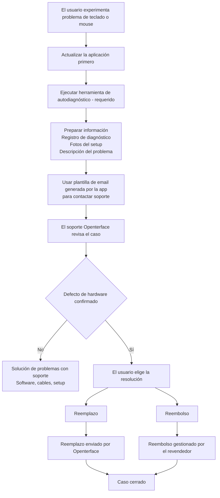

# ¿Problemas con Mini-KVM? Empieza aquí
*Guía de soporte y solución de problemas*

## Estamos aquí para ayudarte

Entendemos lo frustrante que puede ser cuando un dispositivo no funciona como se espera — especialmente cuando estás ansioso por empezar a usarlo.

Esta página explica **qué hacer a continuación**, **cómo te ayudaremos** y **qué esperar** si tu Mini-KVM tiene problemas de control de teclado o mouse.

Nuestro objetivo es ser **claros, tranquilos y justos**, y asegurarnos de que cada usuario afectado sea atendido correctamente.

## Por qué puede estar pasando esto

**Un pequeño número de unidades Mini-KVM de un lote de producción anterior específico** pueden mostrar inestabilidad intermitente de teclado o mouse bajo ciertas condiciones.  
La mayoría de las unidades, incluidas las de lotes anteriores y posteriores, funcionan normalmente.

Puntos clave a saber:

- Afecta **solo a un subconjunto de dispositivos**, no a todos los Mini-KVM
- **No presenta riesgos de seguridad** y **no empeora con el tiempo**

Hemos identificado la causa raíz, mejorado el control de calidad para lotes posteriores y añadido **herramientas de autodiagnóstico** para ayudar a identificar rápidamente los dispositivos afectados.

Para más contexto y antecedentes técnicos, consulta:

- [El teclado y el mouse no pueden controlar el ordenador de destino](/product/minikvm/support/keyboard-mouse-control/)
- [Problema de teclado y mouse – Análisis técnico](/product/minikvm/updates/260128-keyboard-mouse-issue-analysis/)

Si tu unidad está afectada, nos comprometemos a resolverlo de manera responsable.

## Resumen — Cómo se maneja

## Paso 1 — Ejecutar la autocomprobación de diagnóstico (**Requerido**)

Ejecutar la herramienta de autodiagnóstico es **crítico**.
Nos permite entender el estado de tu dispositivo y evitar suposiciones o retrasos innecesarios.

Por favor ejecuta la herramienta de diagnóstico **antes de contactar soporte**:

**Actualiza la aplicación primero:** Asegúrate de tener la última versión de la [aplicación Openterface](/app) instalada antes de ejecutar el diagnóstico. Verifica el menú de la aplicación para obtener actualizaciones.

* **macOS**
  [https://openterface.com/product/minikvm/support/diagnostic-self-check/](https://openterface.com/product/minikvm/support/diagnostic-self-check/)

* **Windows / Linux**
  [https://openterface.com/product/minikvm/support/diagnostic-self-check-windows/](https://openterface.com/product/minikvm/support/diagnostic-self-check-windows/)

### Por favor prepara:

* El **archivo de registro de diagnóstico** generado por la app
* **Fotos de tu setup** (conexiones USB a host y destino)
* Una breve descripción del comportamiento que observas

Estos elementos son necesarios para proceder.

## Paso 2 — Contactar soporte Openterface (Recomendado vía app)

Después de completar el diagnóstico, la app Openterface **generará automáticamente una plantilla de email de soporte** con la información requerida completada.

**Recomendamos encarecidamente** usar este email generado, ya que garantiza que recibimos todo lo necesario para ayudarte eficientemente.

Por favor revisa el email y envíalo a:

📧 **[support@openterface.com](mailto:support@openterface.com)**

Asegúrate de que el email incluya:

* Tu **número de pedido** (Crowd Supply, Mouser u otro revendedor)
* Registro de diagnóstico
* Fotos del setup
* Una breve descripción de los síntomas

### Tiempo de respuesta esperado

* **Respuesta inicial:** en **48 horas laborables** (lunes–viernes)
* Algunos casos pueden requerir:

  * preguntas de seguimiento
  * pasos de diagnóstico adicionales
  * aclaración de detalles del setup

Revisamos cada caso cuidadosamente y no dependemos de decisiones automatizadas.

## Paso 3 — Resultado del diagnóstico

### Si no se encuentra problema de hardware

Continuaremos la solución de problemas contigo — incluyendo configuración de software, cables y comprobaciones del entorno.

### Si se confirma un defecto de hardware

Se te dará **una opción clara** entre reemplazo o reembolso.

## Reemplazo vs Reembolso — Punto de decisión importante

### Opción A — Reemplazo (Gestionado por Openterface)

* Enviamos un **Mini-KVM de reemplazo** directamente a ti
* No es necesario devolver la unidad defectuosa
* Esta suele ser la **forma más rápida** de obtener un dispositivo funcional

**Importante:**
Una vez enviado un reemplazo, **la elegibilidad para reembolso queda bloqueada**.
Esto previene compensación duplicada y mantiene el proceso justo para todos.

### Opción B — Reembolso (Gestionado por el revendedor)

* Los reembolsos deben ser procesados **por la plataforma donde compraste**
  (ej. Crowd Supply, Mouser)
* Proporcionaremos confirmación técnica si se requiere
* El tiempo de procesamiento depende de la política y SLA del revendedor

Si prefieres un reembolso, **no solicites primero un reemplazo**.

## Soporte adicional (cuando sea necesario)

En casos más complejos, después de revisar los registros y detalles del setup, nuestro equipo técnico **puede organizar una videollamada en vivo** (ej. Google Meet) para guiarte paso a paso.

Ten en cuenta:

* Las videollamadas se organizan **solo cuando es necesario**
* Normalmente revisamos primero la información de diagnóstico y los intercambios por email

Esta opción existe para tranquilizarte de que hay soporte más profundo disponible si lo necesitas.

## Cómo se coordinan reembolsos y reemplazos

* Openterface gestiona **diagnóstico técnico y reemplazos**
* Los revendedores gestionan **reembolsos**
* Mantenemos un registro de coordinación interno para garantizar:

  * Sin reemplazo + reembolso duplicado
  * Responsabilidad clara entre equipos

Esto protege tanto a usuarios como a socios manteniendo el soporte consistente.

## Alcance y límites

Este proceso de soporte aplica a:

* **Problemas de teclado/mouse relacionados con hardware**
* **Un número limitado de unidades de un lote de producción anterior específico**

No aplica a:

* Arrepentimiento de compra
* Devoluciones sin abrir
* Solicitudes de reembolso no técnicas

Estos casos son gestionados directamente por el revendedor.

## Nuestro compromiso

Apreciamos sinceramente la confianza que depositas en Openterface.

Cuando algo no sale como planeado, no lo ignoraremos ni te dejaremos sin respuestas. Nos tomaremos el tiempo para explicar qué está pasando, trabajar contigo para resolverlo y asegurarnos de que seas tratado de manera justa.

Si no estás seguro de qué opción tiene más sentido, simplemente contáctanos. Estamos aquí para ayudarte a resolverlo — juntos.

Gracias por apoyarnos y por ayudarnos a mejorar Openterface.

—  
**El equipo Openterface**
