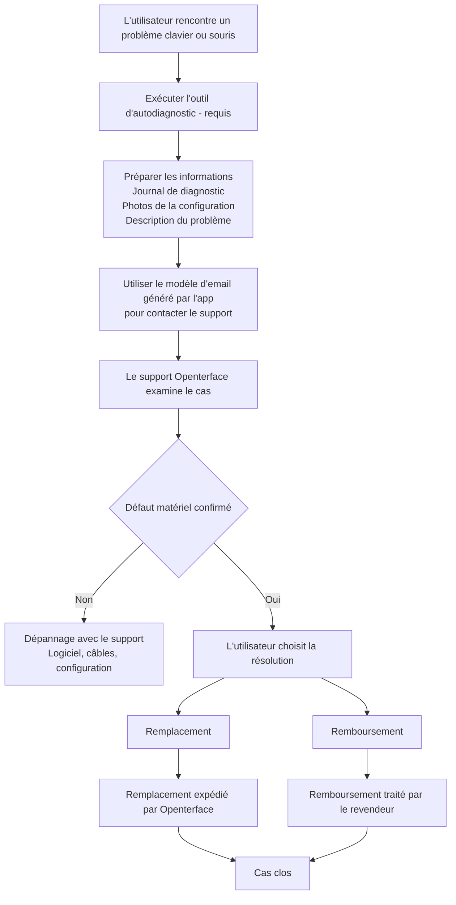

# Des problèmes avec le Mini-KVM ? Commencez ici
*Guide de support et dépannage*

## Nous sommes là pour vous aider

Nous comprenons à quel point c'est frustrant quand un appareil ne fonctionne pas comme prévu — surtout quand vous avez hâte de commencer à l'utiliser.

Cette page explique **quoi faire ensuite**, **comment nous vous aiderons** et **à quoi s'attendre** si votre Mini-KVM rencontre des problèmes de contrôle du clavier ou de la souris.

Notre objectif est d'être **clairs, calmes et équitables**, et de nous assurer que chaque utilisateur concerné est correctement pris en charge.

## Pourquoi cela peut arriver

**Un petit nombre d'unités Mini-KVM d'un lot de production antérieur spécifique** peuvent présenter une instabilité intermittente du clavier ou de la souris dans certaines conditions.  
La plupart des unités, y compris les lots antérieurs et ultérieurs, fonctionnent normalement.

Points clés à connaître :

- Cela n'affecte **qu'un sous-ensemble d'appareils**, pas tous les Mini-KVM
- Cela **ne présente pas de risques pour la sécurité** et **ne s'aggrave pas avec le temps**

Nous avons identifié la cause racine, amélioré le contrôle qualité pour les lots ultérieurs et ajouté des **outils d'autodiagnostic** pour aider à identifier rapidement les appareils concernés.

Pour plus de contexte et d'informations techniques, veuillez consulter :

- [Le clavier et la souris ne peuvent pas contrôler l'ordinateur cible](/product/minikvm/support/keyboard-mouse-control/)
- [Problème clavier et souris – Analyse technique](/product/minikvm/updates/260128-keyboard-mouse-issue-analysis/)

Si votre unité est concernée, nous nous engageons à résoudre le problème de manière responsable.

## Aperçu — Comment c'est géré

## Étape 1 — Exécuter l'autodiagnostic (**Requis**)

L'exécution de l'outil d'autodiagnostic est **critique**.
Cela nous permet de comprendre l'état de votre appareil et d'éviter les conjectures ou les retards inutiles.

Veuillez exécuter l'outil de diagnostic **avant de contacter le support** :

* **macOS**
  [https://openterface.com/product/minikvm/support/diagnostic-self-check/](https://openterface.com/product/minikvm/support/diagnostic-self-check/)

* **Windows / Linux**
  [https://openterface.com/product/minikvm/support/diagnostic-self-check-windows/](https://openterface.com/product/minikvm/support/diagnostic-self-check-windows/)

### Veuillez préparer :

* Le **fichier journal de diagnostic** généré par l'application
* **Des photos de votre configuration** (connexions USB à l'hôte et à la cible)
* Une brève description du comportement que vous observez

Ces éléments sont requis pour que nous puissions poursuivre.

## Étape 2 — Contacter le support Openterface (Recommandé via l'app)

Une fois le diagnostic terminé, l'application Openterface **générera automatiquement un modèle d'email de support** avec les informations requises remplies.

Nous **recommandons vivement** d'utiliser cet email généré, car il garantit que nous recevons tout ce qui est nécessaire pour vous aider efficacement.

Veuillez examiner l'email et l'envoyer à :

📧 **[support@openterface.com](mailto:support@openterface.com)**

Assurez-vous que l'email inclut :

* Votre **numéro de commande** (Crowd Supply, Mouser ou autre revendeur)
* Le journal de diagnostic
* Les photos de la configuration
* Une courte description des symptômes

### Délai de réponse attendu

* **Réponse initiale :** dans les **48 heures ouvrables** (lundi–vendredi)
* Certains cas peuvent nécessiter :

  * des questions de suivi
  * des étapes de diagnostic supplémentaires
  * des clarifications sur les détails de la configuration

Nous examinons chaque cas attentivement et ne nous appuyons pas sur des décisions automatisées.

## Étape 3 — Résultat du diagnostic

### Si aucun problème matériel n'est trouvé

Nous continuerons le dépannage avec vous — y compris la configuration logicielle, les câbles et les vérifications de l'environnement.

### Si un défaut matériel est confirmé

Vous aurez **un choix clair** entre remplacement ou remboursement.

## Remplacement vs Remboursement — Point de décision important

### Option A — Remplacement (Traité par Openterface)

* Nous expédions un **Mini-KVM de remplacement** directement à vous
* Pas besoin de retourner l'unité défectueuse
* C'est généralement la **méthode la plus rapide** pour obtenir un appareil fonctionnel

**Important :**
Une fois un remplacement expédié, **l'éligibilité au remboursement est verrouillée**.
Cela évite une double compensation et maintient le processus équitable pour tous.

### Option B — Remboursement (Traité par le revendeur)

* Les remboursements doivent être traités **par la plateforme auprès de laquelle vous avez acheté**
  (ex. Crowd Supply, Mouser)
* Nous fournirons une confirmation technique si nécessaire
* Le délai de traitement dépend de la politique et du SLA du revendeur

Si vous préférez un remboursement, veuillez **ne pas demander d'abord un remplacement**.

## Support supplémentaire (si nécessaire)

Dans les cas plus complexes, après avoir examiné les journaux et les détails de la configuration, notre équipe technique **peut organiser un appel vidéo en direct** (ex. Google Meet) pour vous guider étape par étape.

Veuillez noter :

* Les appels vidéo sont organisés **uniquement en cas de nécessité**
* Nous examinons généralement d'abord les informations de diagnostic et les échanges par email

Cette option existe pour vous rassurer qu'un support plus approfondi est disponible si nécessaire.

## Comment les remboursements et remplacements sont coordonnés

* Openterface gère le **diagnostic technique et les remplacements**
* Les revendeurs gèrent les **remboursements**
* Nous maintenons un registre de coordination interne pour garantir :

  * Pas de remplacement + remboursement en double
  * Une responsabilité claire entre les équipes

Cela protège à la fois les utilisateurs et les partenaires tout en maintenant une cohérence du support.

## Périmètre et limites

Ce processus de support s'applique à :

* **Les problèmes clavier/souris liés au matériel**
* **Un nombre limité d'unités d'un lot de production antérieur spécifique**

Il ne s'applique **pas** à :

* Les regrets d'achat
* Les retours non ouverts
* Les demandes de remboursement non techniques

Ces cas sont traités directement par le revendeur.

## Notre engagement

Nous apprécions sincèrement la confiance que vous accordez à Openterface.

Quand quelque chose ne se passe pas comme prévu, nous ne l'ignorerons pas ni ne vous laisserons dans le doute. Nous prendrons le temps d'expliquer ce qui se passe, de travailler avec vous pour résoudre le problème et de nous assurer que vous êtes traité équitablement.

Si vous n'êtes pas sûr de l'option qui convient le mieux, contactez-nous simplement. Nous sommes là pour vous aider à comprendre — ensemble.

Merci de rester avec nous et de nous aider à améliorer Openterface.

—  
**L'équipe Openterface**
