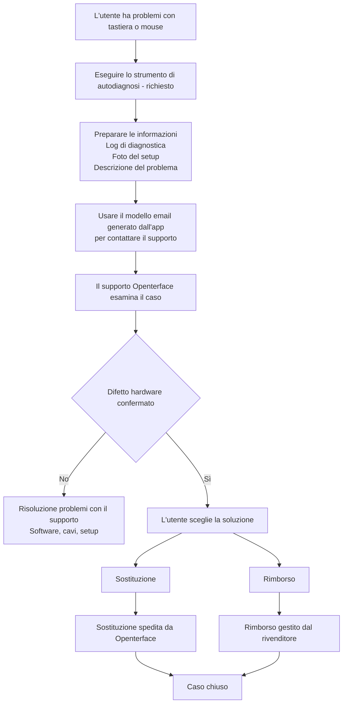

# Problemi con Mini-KVM? Inizia qui
*Guida al supporto e alla risoluzione dei problemi*

## Siamo qui per aiutarti

Capiamo quanto possa essere frustrante quando un dispositivo non funziona come previsto — soprattutto quando non vedi l'ora di iniziare a usarlo.

Questa pagina spiega **cosa fare dopo**, **come ti aiuteremo** e **cosa aspettarsi** se il tuo Mini-KVM presenta problemi di controllo della tastiera o del mouse.

Il nostro obiettivo è essere **chiari, calmi ed equi** e assicurarci che ogni utente interessato sia adeguatamente assistito.

## Perché potrebbe succedere

**Un piccolo numero di unità Mini-KVM da un lotto di produzione precedente specifico** potrebbe mostrare instabilità intermittente della tastiera o del mouse in determinate condizioni.  
La maggior parte delle unità, inclusi i lotti precedenti e successivi, funziona normalmente.

Punti chiave da sapere:

- Colpisce **solo un sottoinsieme di dispositivi**, non tutti i Mini-KVM
- **Non comporta rischi per la sicurezza** e **non peggiora nel tempo**

Abbiamo identificato la causa principale, migliorato il controllo qualità per i lotti successivi e aggiunto **strumenti di autodiagnosi** per aiutare a identificare rapidamente i dispositivi interessati.

Per maggiori informazioni e contesto tecnico, consulta:

- [Tastiera e mouse non possono controllare il computer di destinazione](/product/minikvm/support/keyboard-mouse-control/)
- [Problema tastiera e mouse – Analisi tecnica](/product/minikvm/updates/260128-keyboard-mouse-issue-analysis/)

Se la tua unità è interessata, ci impegniamo a risolverla in modo responsabile.

## Panoramica — Come viene gestito

## Passo 1 — Eseguire l'autodiagnosi (**Richiesto**)

Eseguire lo strumento di autodiagnosi è **critico**.
Ci permette di comprendere lo stato del tuo dispositivo ed evitare congetture o ritardi inutili.

Esegui lo strumento di diagnostica **prima di contattare il supporto**:

* **macOS**
  [https://openterface.com/product/minikvm/support/diagnostic-self-check/](https://openterface.com/product/minikvm/support/diagnostic-self-check/)

* **Windows / Linux**
  [https://openterface.com/product/minikvm/support/diagnostic-self-check-windows/](https://openterface.com/product/minikvm/support/diagnostic-self-check-windows/)

### Prepara:

* Il **file di log di diagnostica** generato dall'app
* **Foto del tuo setup** (connessioni USB a host e target)
* Una breve descrizione del comportamento che osservi

Questi elementi sono richiesti per procedere.

## Passo 2 — Contattare il supporto Openterface (Consigliato tramite app)

Dopo il completamento della diagnostica, l'app Openterface **genererà automaticamente un modello email di supporto** con le informazioni richieste compilate.

**Consigliamo vivamente** di utilizzare questa email generata, poiché garantisce che riceviamo tutto ciò che serve per aiutarti in modo efficiente.

Rivedi l'email e inviala a:

📧 **[support@openterface.com](mailto:support@openterface.com)**

Assicurati che l'email includa:

* Il tuo **numero d'ordine** (Crowd Supply, Mouser o altro rivenditore)
* Log di diagnostica
* Foto del setup
* Una breve descrizione dei sintomi

### Tempo di risposta atteso

* **Risposta iniziale:** entro **48 ore lavorative** (lunedì–venerdì)
* Alcuni casi possono richiedere:

  * domande di follow-up
  * passaggi diagnostici aggiuntivi
  * chiarimenti sui dettagli del setup

Esaminiamo ogni caso attentamente e non ci affidiamo a decisioni automatizzate.

## Passo 3 — Esito della diagnosi

### Se non viene trovato alcun problema hardware

Continueremo la risoluzione dei problemi con te — inclusa configurazione software, cavi e controlli ambientali.

### Se viene confermato un difetto hardware

Ti verrà data **una scelta chiara** tra sostituzione o rimborso.

## Sostituzione vs Rimborso — Punto di decisione importante

### Opzione A — Sostituzione (Gestita da Openterface)

* Spediamo un **Mini-KVM di sostituzione** direttamente a te
* Non è necessario restituire l'unità difettosa
* Questo è di solito il **modo più veloce** per ottenere un dispositivo funzionante

**Importante:**
Una volta spedita una sostituzione, **l'idoneità al rimborso è bloccata**.
Questo previene compensazioni duplicate e mantiene il processo equo per tutti.

### Opzione B — Rimborso (Gestito dal rivenditore)

* I rimborsi devono essere elaborati **dalla piattaforma da cui hai acquistato**
  (es. Crowd Supply, Mouser)
* Forniremo conferma tecnica se richiesta
* I tempi di elaborazione dipendono dalla politica e SLA del rivenditore

Se preferisci un rimborso, **non richiedere prima una sostituzione**.

## Supporto aggiuntivo (quando necessario)

Nei casi più complessi, dopo aver esaminato i log e i dettagli del setup, il nostro team tecnico **può organizzare una videochiamata in diretta** (es. Google Meet) per guidarti passo dopo passo.

Nota:

* Le videochiamate sono organizzate **solo quando necessario**
* In genere esaminiamo prima le informazioni diagnostiche e gli scambi email

Questa opzione esiste per rassicurarti che un supporto più approfondito è disponibile se necessario.

## Come vengono coordinati rimborsi e sostituzioni

* Openterface gestisce **diagnosi tecnica e sostituzioni**
* I rivenditori gestiscono i **rimborsi**
* Manteniamo un registro di coordinamento interno per garantire:

  * Nessuna sostituzione + rimborso duplicato
  * Responsabilità chiara tra i team

Questo protegge sia gli utenti che i partner mantenendo il supporto coerente.

## Ambito e limiti

Questo processo di supporto si applica a:

* **Problemi tastiera/mouse hardware correlati**
* **Un numero limitato di unità da un lotto di produzione precedente specifico**

Non si applica a:

* Rimpianti d'acquisto
* Resi non aperti
* Richieste di rimborso non tecniche

Questi casi sono gestiti direttamente dal rivenditore.

## Il nostro impegno

Apprezziamo sinceramente la fiducia che riponi in Openterface.

Quando qualcosa non va come previsto, non la ignoreremo né ti lasceremo nel dubbio. Ci prenderemo il tempo per spiegare cosa sta succedendo, lavorare con te per risolverlo e assicurarci che tu sia trattato equamente.

Se non sei sicuro di quale opzione abbia più senso, contattaci semplicemente. Siamo qui per aiutarti a capirlo — insieme.

Grazie per averci supportato e per averci aiutato a migliorare Openterface.

—  
**Il team Openterface**
