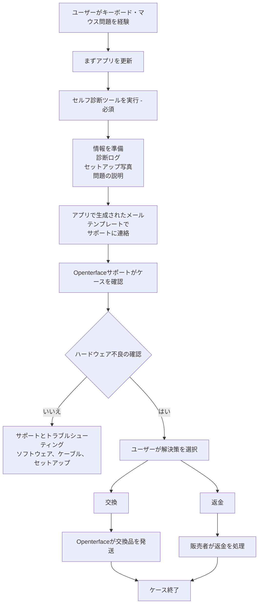

# Mini-KVMでお困りですか？まずはこちら
*サポート＆トラブルシューティングガイド*

## お手伝いいたします

デバイスが期待通りに動作しないときのフラストレーションはよく理解しています。特に使い始めようとしているときはなおさらです。

このページでは、Mini-KVMでキーボードやマウスの制御に問題がある場合の**次のステップ**、**サポートの内容**、**期待できる対応**について説明します。

私たちの目標は**明確で、落ち着いた、公平な**対応を心がけ、影響を受けたすべてのユーザーを適切にお世話することです。

## 考えられる原因

**特定の以前の生産ロットのごく一部のMini-KVMユニット**が、特定の条件下でキーボードやマウスの不安定さを示す場合があります。  
大多数のユニット、および以前・以降のロットは正常に動作しています。

重要なポイント：

- **一部のデバイスのみ**に影響し、すべてのMini-KVMではありません
- **安全上のリスクはなく**、**時間の経過とともに悪化することもありません**

根本原因を特定し、以降のロットのQAを改善し、**セルフ診断ツール**を追加して、影響を受けたデバイスを迅速に特定できるようにしました。

詳細な背景と技術的な文脈については、以下をご覧ください：

- [キーボードとマウスでターゲットPCを制御できない](/product/minikvm/support/keyboard-mouse-control/)
- [キーボード＆マウス問題 – 技術分析](/product/minikvm/updates/260128-keyboard-mouse-issue-analysis/)

お使いのユニットに影響がある場合、責任を持って解決いたします。

## 概要 — 対応の流れ

## ステップ1 — 診断セルフチェックを実行（**必須**）

セルフ診断ツールの実行は**重要**です。
デバイスの状態を把握し、推測や不要な遅延を避けることができます。

**サポートに連絡する前に**診断ツールを実行してください：

**まずアプリを更新:** 診断を実行する前に、[Openterfaceアプリ](/app)の最新バージョンがインストールされていることを確認してください。アプリメニューでアップデートを確認してください。

* **macOS**
  [https://openterface.com/product/minikvm/support/diagnostic-self-check/](https://openterface.com/product/minikvm/support/diagnostic-self-check/)

* **Windows / Linux**
  [https://openterface.com/product/minikvm/support/diagnostic-self-check-windows/](https://openterface.com/product/minikvm/support/diagnostic-self-check-windows/)

### ご準備ください：

* アプリで生成された**診断ログファイル**
* **セットアップの写真**（ホストとターゲットへのUSB接続）
* 観察している動作の簡単な説明

これらは対応を進めるために必要です。

## ステップ2 — Openterfaceサポートに連絡（アプリ経由を推奨）

診断が完了すると、Openterfaceアプリが**必要な情報を入力したサポートメールテンプレートを自動生成**します。

効率的にお手伝いするために必要な情報がすべて届くため、この生成メールの使用を**強く推奨**します。

メールを確認のうえ、以下に送信してください：

📧 **[support@openterface.com](mailto:support@openterface.com)**

メールに以下が含まれていることを確認してください：

* **注文番号**（Crowd Supply、Mouser、その他の販売者）
* 診断ログ
* セットアップ写真
* 症状の簡単な説明

### 返信までの目安

* **初回返信：** **48営業時間以内**（月曜〜金曜）
* 一部のケースでは以下が必要な場合があります：

  * 追加の質問
  * 追加の診断ステップ
  * セットアップ詳細の確認

各ケースを慎重に確認し、自動判断には頼りません。

## ステップ3 — 診断結果

### ハードウェア問題が見つからない場合

ソフトウェア設定、ケーブル、環境チェックを含め、引き続きトラブルシューティングを行います。

### ハードウェア不良が確認された場合

**交換**または**返金**のいずれかを明確に選択いただけます。

## 交換と返金 — 重要な選択ポイント

### オプションA — 交換（Openterfaceが対応）

* **交換用Mini-KVM**を直接お届けします
* 不良品の返送は不要です
* 動作するデバイスを入手する**最も早い方法**です

**重要：**
交換品を発送した時点で、**返金の資格はロックされます**。
二重補償を防ぎ、すべての方に公平なプロセスを維持するためです。

### オプションB — 返金（販売者が対応）

* 返金は**ご購入いただいたプラットフォーム**で処理する必要があります
  （例：Crowd Supply、Mouser）
* 技術的な確認が必要な場合は提供します
* 処理時間は販売者のポリシーとSLAによります

返金をご希望の場合は、**まず交換をリクエストしないでください**。

## 追加サポート（必要な場合）

より複雑なケースでは、ログとセットアップ詳細を確認した後、技術チームが**ライブビデオ通話**（例：Google Meet）を手配し、ステップバイステップでご案内する場合があります。

ご注意：

* ビデオ通話は**必要な場合にのみ**手配します
* 通常、まず診断情報とメールのやり取りを確認します

より深いサポートが必要な場合に利用できることをお伝えするためのオプションです。

## 返金と交換の調整

* Openterfaceは**技術診断と交換**を担当
* 販売者は**返金**を担当
* 以下の点を確保するため、内部調整記録を維持しています：

  * 交換と返金の重複なし
  * チーム間の責任の明確化

これにより、ユーザーとパートナーの両方を保護し、サポートの一貫性を保っています。

## 対象範囲と境界

このサポートプロセスは以下に適用されます：

* **ハードウェア関連のキーボード/マウス問題**
* **特定の以前のロットの限られた数のユニット**

以下には**適用されません**：

* 購入後の後悔
* 未開封の返品
* 非技術的な返金リクエスト

これらのケースは販売者が直接対応します。

## 私たちの約束

Openterfaceへのご信頼に心より感謝いたします。

計画通りにいかないことがあっても、見過ごしたり、お客様を不安にさせたりすることはありません。状況を説明し、一緒に解決し、公平に扱われるよう努めます。

どのオプションが最適かわからない場合は、お気軽にご連絡ください。一緒に考えましょう。

Openterfaceをより良くするためにご協力いただき、ありがとうございます。

—  
**Openterfaceチーム**
