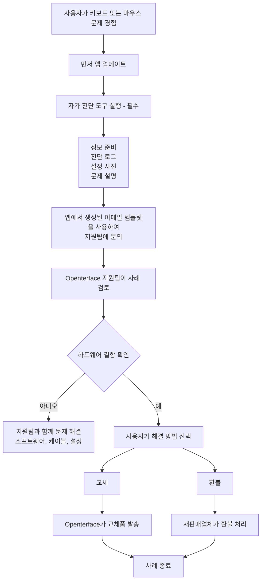

# Mini-KVM에 문제가 있으신가요? 여기서 시작하세요
*지원 및 문제 해결 가이드*

## 도움을 드리겠습니다

기기가 예상대로 작동하지 않을 때의 답답함을 잘 이해합니다. 특히 사용을 시작하려 할 때 더욱 그렇습니다.

이 페이지에서는 Mini-KVM에서 키보드 또는 마우스 제어 문제가 발생한 경우 **다음에 할 일**, **저희가 어떻게 도와드리는지**, **기대할 수 있는 것**을 설명합니다.

저희의 목표는 **명확하고, 차분하고, 공정하게** 대응하여 영향을 받는 모든 사용자가 적절히 보살핌을 받도록 하는 것입니다.

## 발생할 수 있는 이유

**특정 이전 생산 배치의 소수의 Mini-KVM 유닛**이 특정 조건에서 간헐적인 키보드 또는 마우스 불안정을 보일 수 있습니다.  
대부분의 유닛, 이전 및 이후 배치를 포함하여 정상적으로 작동합니다.

알아두어야 할 핵심 사항:

- **일부 기기에만** 영향을 미치며, 모든 Mini-KVM이 아닙니다
- **안전 위험이 없으며** **시간이 지나도 악화되지 않습니다**

근본 원인을 파악했으며, 이후 배치의 QA를 개선하고 **자가 진단 도구**를 추가하여 영향을 받는 기기를 빠르게 식별할 수 있도록 했습니다.

자세한 배경 및 기술적 맥락은 다음을 참조하세요:

- [키보드와 마우스로 대상 컴퓨터를 제어할 수 없음](/product/minikvm/support/keyboard-mouse-control/)
- [키보드 및 마우스 문제 – 기술 분석](/product/minikvm/updates/260128-keyboard-mouse-issue-analysis/)

귀하의 유닛에 영향을 받는 경우, 책임감 있게 해결하겠습니다.

## 개요 — 처리 방식

## 1단계 — 진단 자가 점검 실행(**필수**)

자가 진단 도구 실행은 **매우 중요**합니다.
기기 상태를 파악하고 추측이나 불필요한 지연을 피할 수 있습니다.

**지원팀에 문의하기 전에** 진단 도구를 실행해 주세요:

**먼저 앱을 업데이트하세요:** 진단을 실행하기 전에 [Openterface 앱](/app)의 최신 버전이 설치되어 있는지 확인하세요. 앱 메뉴에서 업데이트를 확인하세요.

* **macOS**
  [https://openterface.com/product/minikvm/support/diagnostic-self-check/](https://openterface.com/product/minikvm/support/diagnostic-self-check/)

* **Windows / Linux**
  [https://openterface.com/product/minikvm/support/diagnostic-self-check-windows/](https://openterface.com/product/minikvm/support/diagnostic-self-check-windows/)

### 준비해 주세요:

* 앱에서 생성된 **진단 로그 파일**
* **설정 사진** (호스트 및 대상에 대한 USB 연결)
* 관찰 중인 동작에 대한 간단한 설명

이 항목들은 진행에 필요합니다.

## 2단계 — Openterface 지원팀에 문의 (앱을 통한 것이 권장됨)

진단이 완료되면 Openterface 앱이 **필요한 정보가 입력된 지원 이메일 템플릿을 자동으로 생성**합니다.

효율적으로 도움을 드리기 위해 필요한 모든 정보를 받을 수 있도록 이 생성된 이메일 사용을 **강력히 권장**합니다.

이메일을 검토하여 다음으로 보내 주세요:

📧 **[support@openterface.com](mailto:support@openterface.com)**

이메일에 다음이 포함되어 있는지 확인하세요:

* **주문 번호** (Crowd Supply, Mouser 또는 기타 재판매업체)
* 진단 로그
* 설정 사진
* 증상에 대한 간단한 설명

### 응답 시간 예상

* **최초 응답:** **48 영업 시간 이내** (월요일~금요일)
* 일부 사례에서는 다음이 필요할 수 있습니다:

  * 후속 질문
  * 추가 진단 단계
  * 설정 세부사항 확인

각 사례를 신중히 검토하며 자동화된 결정에 의존하지 않습니다.

## 3단계 — 진단 결과

### 하드웨어 문제가 발견되지 않은 경우

소프트웨어 구성, 케이블, 환경 점검을 포함하여 계속 문제 해결을 진행합니다.

### 하드웨어 결함이 확인된 경우

**교체** 또는 **환불** 중 **명확한 선택**을 제공합니다.

## 교체 vs 환불 — 중요한 선택 시점

### 옵션 A — 교체 (Openterface가 처리)

* **교체 Mini-KVM**을 직접 발송합니다
* 결함이 있는 유닛을 반환할 필요가 없습니다
* 작동하는 기기를 받는 **가장 빠른 방법**입니다

**중요:**
교체품이 발송되면 **환불 자격이 잠깁니다**.
중복 보상을 방지하고 모든 사람에게 공정한 프로세스를 유지하기 위함입니다.

### 옵션 B — 환불 (재판매업체가 처리)

* 환불은 **구매한 플랫폼**에서 처리해야 합니다
  (예: Crowd Supply, Mouser)
* 기술적 확인이 필요한 경우 제공합니다
* 처리 시간은 재판매업체의 정책과 SLA에 따릅니다

환불을 선호하시면 **먼저 교체를 요청하지 마세요**.

## 추가 지원 (필요한 경우)

더 복잡한 사례에서는 로그와 설정 세부사항을 검토한 후, 기술 팀이 **실시간 화상 통화** (예: Google Meet)를 조정하여 단계별로 안내할 수 있습니다.

참고:

* 화상 통화는 **필요한 경우에만** 조정됩니다
* 일반적으로 먼저 진단 정보와 이메일 교환을 검토합니다

필요한 경우 더 깊은 지원을 받을 수 있음을 안심시키기 위한 옵션입니다.

## 환불과 교체의 조정

* Openterface는 **기술 진단 및 교체**를 담당
* 재판매업체는 **환불**을 담당
* 다음을 보장하기 위해 내부 조정 기록을 유지합니다:

  * 교체 + 환불 중복 없음
  * 팀 간 책임 명확화

이를 통해 사용자와 파트너를 모두 보호하면서 지원의 일관성을 유지합니다.

## 범위 및 한계

이 지원 프로세스는 다음에 적용됩니다:

* **하드웨어 관련 키보드/마우스 문제**
* **특정 이전 배치의 제한된 수의 유닛**

다음에는 **적용되지 않습니다**:

* 구매 후회
* 미개봉 반품
* 비기술적 환불 요청

이러한 사례는 재판매업체가 직접 처리합니다.

## 저희의 약속

Openterface에 대한 신뢰에 진심으로 감사드립니다.

계획대로 되지 않을 때, 저희는 무시하거나 추측하게 두지 않습니다. 상황을 설명하고, 함께 해결하며, 공정하게 대우받도록 하겠습니다.

어떤 옵션이 가장 적합한지 확실하지 않으시면 연락해 주세요. 함께 알아보겠습니다.

Openterface를 더 나은 것으로 만드는 데 도움을 주셔서 감사합니다.

—  
**Openterface 팀**
