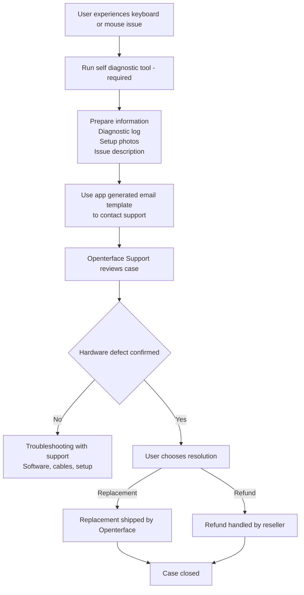

# Having Trouble with Mini-KVM? Start Here
*Support & Troubleshooting Guide*

## We’re Here to Help

We understand how frustrating it can be when a device doesn’t work as expected — especially when you’re eager to start using it.

This page explains **what to do next**, **how we’ll help**, and **what to expect** if your Mini-KVM is experiencing keyboard or mouse control issues.

Our goal is to be **clear, calm, and fair**, and to make sure every affected user is properly taken care of.

## Why This May Be Happening

A **small number of Mini-KVM units from a specific previous production batch** may show intermittent keyboard or mouse instability under certain conditions.  
Most units, including earlier and later batches, work normally.

Key things to know:

- It affects **only a subset of devices**, not all Mini-KVMs  
- It does **not pose safety risks** and does **not worsen over time**

We’ve identified the root cause, improved QA for later batches, and added **self-diagnostic tools** to help quickly identify affected devices.

For more background and technical context, please see:

- [Keyboard and mouse cannot control the target computer](/product/minikvm/support/keyboard-mouse-control/)
- [Keyboard & Mouse Issue – Technical Analysis](/product/minikvm/updates/260128-keyboard-mouse-issue-analysis/)

If your unit is affected, we are committed to resolving it responsibly.

## Overview — How This Is Handled

## Step 1 — Run the Diagnostic Self-Check (**Required**)

Running the self-diagnostic tool is **critical**.
It allows us to understand your device state and avoid guesswork or unnecessary delays.

Please run the diagnostic tool **before contacting support**:

* **macOS**
  [https://openterface.com/product/minikvm/support/diagnostic-self-check/](https://openterface.com/product/minikvm/support/diagnostic-self-check/)

* **Windows / Linux**
  [https://openterface.com/product/minikvm/support/diagnostic-self-check-windows/](https://openterface.com/product/minikvm/support/diagnostic-self-check-windows/)

### Please prepare:

* The **diagnostic log file** generated by the app
* **Photos of your setup** (USB connections to host and target)
* A brief description of the behavior you’re seeing

These items are required for us to proceed.

## Step 2 — Contact Openterface Support (Recommended via App)

After diagnostics complete, the Openterface app will **automatically generate a support email template** with the required information filled in.

We **strongly recommend** using this generated email, as it ensures we receive everything needed to help you efficiently.

Please review the email and send it to:

📧 **[support@openterface.com](mailto:support@openterface.com)**

Make sure the email includes:

* Your **order number** (Crowd Supply, Mouser, or other reseller)
* Diagnostic log
* Setup photos
* A short symptom description

### Response Time Expectation

* **Initial response:** within **48 business hours** (Monday–Friday)
* Some cases may require:

  * follow-up questions
  * additional diagnostic steps
  * clarification of setup details

We review each case carefully and do not rely on automated decisions.

## Step 3 — Diagnosis Outcome

### If no hardware issue is found

We’ll continue troubleshooting with you — including software configuration, cabling, and environment checks.

### If a hardware defect is confirmed

You’ll be given **a clear choice** between replacement or refund.

## Replacement vs Refund — Important Choice Point

### Option A — Replacement (Handled by Openterface)

* We ship a **replacement Mini-KVM** directly to you
* No need to return the defective unit
* This is usually the **fastest way** to get you a working device

**Important:**
Once a replacement is shipped, **refund eligibility is locked**.
This prevents duplicate compensation and keeps the process fair for everyone.

### Option B — Refund (Handled by the Reseller)

* Refunds must be processed **by the platform you purchased from**
  (e.g. Crowd Supply, Mouser)
* We’ll provide technical confirmation if required
* Processing time depends on the reseller’s policy and SLA

If you prefer a refund, please **do not request a replacement first**.

## Additional Support (When Needed)

In more complex cases, after reviewing logs and setup details, our technical team **may arrange a live video call** (e.g. Google Meet) to guide you step-by-step.

Please note:

* Video calls are arranged **only when necessary**
* We typically review diagnostic information and email exchanges first

This option exists to reassure you that deeper support is available if needed.

## How Refunds and Replacements Are Coordinated

* Openterface handles **technical diagnosis and replacements**
* Resellers handle **refunds**
* We maintain an internal coordination record to ensure:

  * No duplicate replacement + refund
  * Clear responsibility between teams

This protects both users and partners while keeping support consistent.

## Scope and Boundary

This support process applies to:

* **Hardware-related keyboard/mouse issues**
* **A limited number of units from a specific previous batch**

It does **not** apply to:

* Buyer’s remorse
* Unopened returns
* Non-technical refund requests

These cases are handled directly by the reseller.

## Our Commitment

We genuinely appreciate the trust you place in Openterface.

When something doesn’t go as planned, we won’t brush it aside or leave you guessing. We’ll take the time to explain what’s going on, work through it with you, and make sure you’re treated fairly.

If you’re not sure which option makes the most sense, just reach out. We’re here to help you figure it out — together.

Thanks for sticking with us and for helping us make Openterface better.

—  
**Openterface Team**