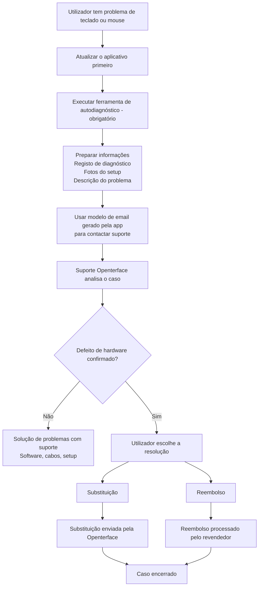

# Problemas com Mini-KVM? Comece aqui
*Guia de suporte e solução de problemas*

## Estamos aqui para ajudar

Entendemos como pode ser frustrante quando um dispositivo não funciona como esperado — especialmente quando você está ansioso para começar a usá-lo.

Esta página explica **o que fazer a seguir**, **como vamos ajudar** e **o que esperar** se o seu Mini-KVM tiver problemas de controlo de teclado ou mouse.

O nosso objetivo é ser **claros, calmos e justos** e garantir que cada utilizador afetado seja devidamente atendido.

## Por que isso pode estar a acontecer

**Um pequeno número de unidades Mini-KVM de um lote de produção anterior específico** pode mostrar instabilidade intermitente de teclado ou mouse sob certas condições.  
A maioria das unidades, incluindo lotes anteriores e posteriores, funciona normalmente.

Pontos importantes a saber:

- Afeta **apenas um subconjunto de dispositivos**, não todos os Mini-KVM
- **Não apresenta riscos de segurança** e **não piora com o tempo**

Identificámos a causa raiz, melhorámos o controlo de qualidade para lotes posteriores e adicionámos **ferramentas de autodiagnóstico** para ajudar a identificar rapidamente os dispositivos afetados.

Para mais contexto e informações técnicas, consulte:

- [Teclado e mouse não conseguem controlar o computador de destino](/product/minikvm/support/keyboard-mouse-control/)
- [Problema de teclado e mouse – Análise técnica](/product/minikvm/updates/260128-keyboard-mouse-issue-analysis/)

Se a sua unidade estiver afetada, comprometemo-nos a resolver de forma responsável.

## Visão geral — Como é tratado

## Passo 1 — Executar a autoverificação de diagnóstico (**Obrigatório**)

Executar a ferramenta de autodiagnóstico é **crítico**.
Permite-nos entender o estado do seu dispositivo e evitar suposições ou atrasos desnecessários.

Por favor execute a ferramenta de diagnóstico **antes de contactar o suporte**:

**Atualize o aplicativo primeiro:** Certifique-se de ter a versão mais recente do [aplicativo Openterface](/app) instalada antes de executar os diagnósticos. Verifique o menu do aplicativo para atualizações.

* **macOS**
  [https://openterface.com/product/minikvm/support/diagnostic-self-check/](https://openterface.com/product/minikvm/support/diagnostic-self-check/)

* **Windows / Linux**
  [https://openterface.com/product/minikvm/support/diagnostic-self-check-windows/](https://openterface.com/product/minikvm/support/diagnostic-self-check-windows/)

### Por favor prepare:

* O **ficheiro de registo de diagnóstico** gerado pela app
* **Fotos do seu setup** (ligações USB ao host e destino)
* Uma breve descrição do comportamento que observa

Estes itens são necessários para prosseguirmos.

## Passo 2 — Contactar suporte Openterface (Recomendado via app)

Após a conclusão do diagnóstico, a app Openterface **gerará automaticamente um modelo de email de suporte** com as informações necessárias preenchidas.

**Recomendamos vivamente** usar este email gerado, pois garante que recebemos tudo o que é necessário para ajudá-lo eficientemente.

Por favor reveja o email e envie-o para:

📧 **[support@openterface.com](mailto:support@openterface.com)**

Certifique-se de que o email inclui:

* O seu **número de encomenda** (Crowd Supply, Mouser ou outro revendedor)
* Registo de diagnóstico
* Fotos do setup
* Uma breve descrição dos sintomas

### Tempo de resposta esperado

* **Resposta inicial:** em **48 horas úteis** (segunda–sexta)
* Alguns casos podem requerer:

  * perguntas de acompanhamento
  * passos de diagnóstico adicionais
  * esclarecimento dos detalhes do setup

Analisamos cada caso cuidadosamente e não dependemos de decisões automatizadas.

## Passo 3 — Resultado do diagnóstico

### Se nenhum problema de hardware for encontrado

Continuaremos a solução de problemas consigo — incluindo configuração de software, cabos e verificações do ambiente.

### Se um defeito de hardware for confirmado

Será dada **uma escolha clara** entre substituição ou reembolso.

## Substituição vs Reembolso — Ponto de decisão importante

### Opção A — Substituição (Tratada pela Openterface)

* Enviamos um **Mini-KVM de substituição** diretamente para si
* Não é necessário devolver a unidade defeituosa
* Esta é geralmente a **forma mais rápida** de obter um dispositivo funcional

**Importante:**
Uma vez enviada uma substituição, **a elegibilidade para reembolso fica bloqueada**.
Isto previne compensação duplicada e mantém o processo justo para todos.

### Opção B — Reembolso (Tratado pelo revendedor)

* Os reembolsos devem ser processados **pela plataforma onde comprou**
  (ex. Crowd Supply, Mouser)
* Forneceremos confirmação técnica se necessário
* O tempo de processamento depende da política e SLA do revendedor

Se preferir reembolso, **não solicite primeiro substituição**.

## Suporte adicional (quando necessário)

Em casos mais complexos, após analisar os registos e detalhes do setup, a nossa equipa técnica **pode organizar uma videochamada ao vivo** (ex. Google Meet) para guiá-lo passo a passo.

Por favor note:

* As videochamadas são organizadas **apenas quando necessário**
* Normalmente analisamos primeiro as informações de diagnóstico e trocas de email

Esta opção existe para o tranquilizar de que suporte mais profundo está disponível se necessário.

## Como reembolsos e substituições são coordenados

* A Openterface trata **diagnóstico técnico e substituições**
* Os revendedores tratam **reembolsos**
* Mantemos um registo de coordenação interno para garantir:

  * Sem substituição + reembolso duplicado
  * Responsabilidade clara entre equipas

Isto protege tanto utilizadores como parceiros mantendo o suporte consistente.

## Âmbito e limites

Este processo de suporte aplica-se a:

* **Problemas de teclado/mouse relacionados com hardware**
* **Um número limitado de unidades de um lote de produção anterior específico**

Não se aplica a:

* Arrependimento de compra
* Devoluções não abertas
* Pedidos de reembolso não técnicos

Estes casos são tratados diretamente pelo revendedor.

## O nosso compromisso

Apreciamos sinceramente a confiança que deposita na Openterface.

Quando algo não corre como planeado, não vamos ignorar ou deixá-lo sem respostas. Vamos tomar o tempo para explicar o que está a acontecer, trabalhar consigo para resolver e garantir que seja tratado de forma justa.

Se não tiver certeza de qual opção faz mais sentido, basta contactar-nos. Estamos aqui para ajudá-lo a descobrir — juntos.

Obrigado por nos apoiar e por nos ajudar a melhorar a Openterface.

—  
**A equipa Openterface**
