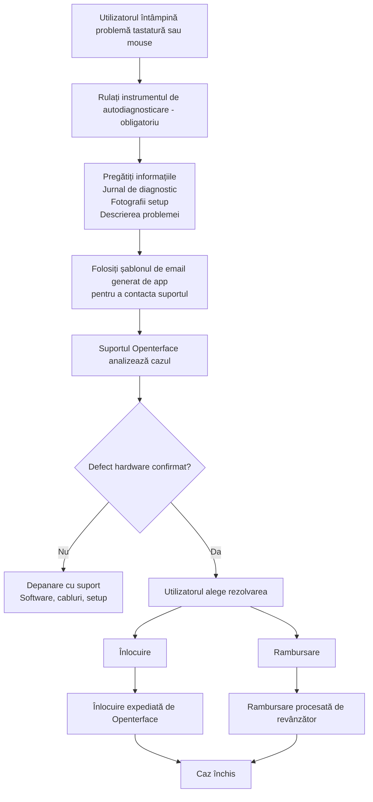

# Probleme cu Mini-KVM? Începeți aici
*Ghid de suport și depanare*

## Suntem aici să vă ajutăm

Înțelegem cât de frustrant poate fi când un dispozitiv nu funcționează conform așteptărilor — mai ales când abia așteptați să începeți să îl folosiți.

Această pagină explică **ce să faceți în continuare**, **cum vă vom ajuta** și **la ce să vă așteptați** dacă Mini-KVM-ul dvs. întâmpină probleme cu controlul tastaturii sau mouse-ului.

Obiectivul nostru este să fim **clari, calmi și echitabili** și să ne asigurăm că fiecare utilizator afectat este îngrijit corespunzător.

## De ce se poate întâmpla acest lucru

**Un număr mic de unități Mini-KVM dintr-un lot de producție anterior specific** pot prezenta instabilitate intermitentă a tastaturii sau mouse-ului în anumite condiții.  
Majoritatea unităților, inclusiv loturile anterioare și ulterioare, funcționează normal.

Lucruri importante de știut:

- Afectează **doar un subset de dispozitive**, nu toate Mini-KVM-urile
- **Nu prezintă riscuri de siguranță** și **nu se agravează în timp**

Am identificat cauza principală, am îmbunătățit controlul calității pentru loturile ulterioare și am adăugat **instrumente de autodiagnosticare** pentru a ajuta la identificarea rapidă a dispozitivelor afectate.

Pentru mai mult context și informații tehnice, consultați:

- [Tastatura și mouse-ul nu pot controla computerul țintă](/product/minikvm/support/keyboard-mouse-control/)
- [Problema tastatură și mouse – Analiză tehnică](/product/minikvm/updates/260128-keyboard-mouse-issue-analysis/)

Dacă unitatea dvs. este afectată, ne angajăm să o rezolvăm în mod responsabil.

## Prezentare generală — Cum este gestionat

## Pasul 1 — Rulați autoverificarea de diagnostic (**Obligatoriu**)

Rularea instrumentului de autodiagnosticare este **critică**.
Ne permite să înțelegem starea dispozitivului dvs. și să evităm presupuneri sau întârzieri inutile.

Vă rugăm să rulați instrumentul de diagnostic **înainte de a contacta suportul**:

* **macOS**
  [https://openterface.com/product/minikvm/support/diagnostic-self-check/](https://openterface.com/product/minikvm/support/diagnostic-self-check/)

* **Windows / Linux**
  [https://openterface.com/product/minikvm/support/diagnostic-self-check-windows/](https://openterface.com/product/minikvm/support/diagnostic-self-check-windows/)

### Vă rugăm să pregătiți:

* **Fișierul jurnal de diagnostic** generat de app
* **Fotografii ale setup-ului dvs.** (conexiuni USB la host și țintă)
* O scurtă descriere a comportamentului pe care îl observați

Aceste elemente sunt necesare pentru a putea continua.

## Pasul 2 — Contactați suportul Openterface (Recomandat prin app)

După finalizarea diagnosticului, app-ul Openterface va **genera automat un șablon de email de suport** cu informațiile necesare completate.

**Recomandăm puternic** utilizarea acestui email generat, deoarece ne asigură că primim tot ce este necesar pentru a vă ajuta eficient.

Vă rugăm să verificați emailul și să îl trimiteți la:

📧 **[support@openterface.com](mailto:support@openterface.com)**

Asigurați-vă că emailul include:

* **Numărul dvs. de comandă** (Crowd Supply, Mouser sau alt revânzător)
* Jurnal de diagnostic
* Fotografii setup
* O scurtă descriere a simptomelor

### Așteptări privind timpul de răspuns

* **Răspuns inițial:** în **48 de ore lucrătoare** (luni–vineri)
* Unele cazuri pot necesita:

  * întrebări de follow-up
  * pași de diagnostic suplimentari
  * clarificări ale detaliilor setup-ului

Analizăm fiecare caz cu atenție și nu ne bazăm pe decizii automatizate.

## Pasul 3 — Rezultatul diagnosticului

### Dacă nu se găsește nicio problemă de hardware

Vom continua depanarea cu dvs. — inclusiv configurarea software, cablurile și verificările mediului.

### Dacă se confirmă un defect de hardware

Vi se va oferi **o alegere clară** între înlocuire sau rambursare.

## Înlocuire vs Rambursare — Punct de decizie important

### Opțiunea A — Înlocuire (Tratată de Openterface)

* Expediăm un **Mini-KVM de înlocuire** direct către dvs.
* Nu este nevoie să returnați unitatea defectuoasă
* Aceasta este de obicei **cea mai rapidă modalitate** de a obține un dispozitiv funcțional

**Important:**
Odată ce o înlocuire este expediată, **eligibilitatea pentru rambursare este blocată**.
Acest lucru previne compensația duplicată și menține procesul echitabil pentru toți.

### Opțiunea B — Rambursare (Tratată de revânzător)

* Rambursările trebuie procesate **de platforma de la care ați cumpărat**
  (ex. Crowd Supply, Mouser)
* Vom furniza confirmare tehnică dacă este necesar
* Timpul de procesare depinde de politica și SLA-ul revânzătorului

Dacă preferați rambursare, **nu solicitați mai întâi înlocuire**.

## Suport suplimentar (când este necesar)

În cazuri mai complexe, după analizarea jurnalelor și detaliilor setup-ului, echipa noastră tehnică **poate aranja un apel video live** (ex. Google Meet) pentru a vă ghida pas cu pas.

Vă rugăm să rețineți:

* Apelurile video sunt aranjate **doar când este necesar**
* De obicei analizăm mai întâi informațiile de diagnostic și schimburile de email

Această opțiune există pentru a vă asigura că suport mai profund este disponibil dacă aveți nevoie.

## Cum sunt coordonate rambursările și înlocuirile

* Openterface gestionează **diagnosticul tehnic și înlocuirile**
* Revânzătorii gestionează **rambursările**
* Menținem un registru de coordonare intern pentru a asigura:

  * Fără înlocuire + rambursare duplicată
  * Responsabilitate clară între echipe

Acest lucru protejează atât utilizatorii cât și partenerii menținând suportul consistent.

## Domeniu de aplicare și limite

Acest proces de suport se aplică la:

* **Probleme de tastatură/mouse legate de hardware**
* **Un număr limitat de unități dintr-un lot de producție anterior specific**

Nu se aplică la:

* Regretul achiziției
* Returnări ne deschise
* Cereri de rambursare non-tehnice

Aceste cazuri sunt tratate direct de revânzător.

## Angajamentul nostru

Apreciem sincer încrederea pe care o acordați Openterface.

Când ceva nu merge conform planului, nu vom ignora sau vă vom lăsa fără răspunsuri. Ne vom lua timpul să explicăm ce se întâmplă, să lucrăm cu dvs. pentru a rezolva și să ne asigurăm că sunteți tratați echitabil.

Dacă nu sunteți sigur care opțiune are mai mult sens, contactați-ne pur și simplu. Suntem aici să vă ajutăm să descoperiți — împreună.

Mulțumim că rămâneți alături de noi și că ne ajutați să îmbunătățim Openterface.

—  
**Echipa Openterface**
