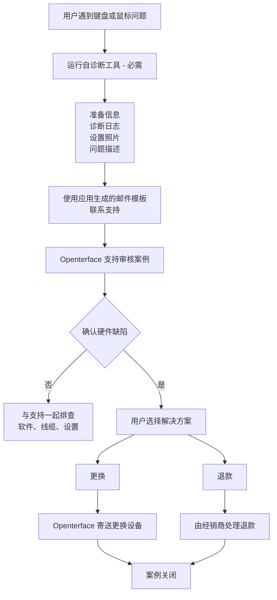

# Mini-KVM 遇到问题？从这里开始
*支持与故障排查指南*

## 我们随时为您提供帮助

我们理解当设备无法按预期工作时会有多令人沮丧——尤其是当您急于开始使用它时。

本页说明**接下来该做什么**、**我们将如何帮助您**，以及如果您的 Mini-KVM 遇到键盘或鼠标控制问题**可以期待什么**。

我们的目标是**清晰、冷静、公平**，并确保每位受影响的用户都能得到妥善照顾。

## 可能的原因

**特定先前生产批次中的少量 Mini-KVM 设备**在某些条件下可能会出现间歇性的键盘或鼠标不稳定。  
大多数设备，包括早期和后期批次，均正常工作。

需要了解的关键点：

- 仅影响**部分设备**，并非所有 Mini-KVM
- **不构成安全风险**，也**不会随时间恶化**

我们已确定根本原因，改进了后续批次的质检，并添加了**自诊断工具**以帮助快速识别受影响的设备。

更多背景和技术说明，请参阅：

- [键盘和鼠标无法控制目标计算机](/product/minikvm/support/keyboard-mouse-control/)
- [键盘和鼠标问题 – 技术分析](/product/minikvm/updates/260128-keyboard-mouse-issue-analysis/)

如果您的设备受到影响，我们承诺负责任地解决。

## 概述 — 处理流程

## 步骤 1 — 运行诊断自检（**必需**）

运行自诊断工具**至关重要**。
它使我们能够了解您的设备状态，避免猜测或不必要的延误。

请**在联系支持之前**运行诊断工具：

* **macOS**
  [https://openterface.com/product/minikvm/support/diagnostic-self-check/](https://openterface.com/product/minikvm/support/diagnostic-self-check/)

* **Windows / Linux**
  [https://openterface.com/product/minikvm/support/diagnostic-self-check-windows/](https://openterface.com/product/minikvm/support/diagnostic-self-check-windows/)

### 请准备：

* 应用生成的**诊断日志文件**
* **设置照片**（主机和目标设备的 USB 连接）
* 您所观察到的行为的简要描述

这些项目是我们继续处理所必需的。

## 步骤 2 — 联系 Openterface 支持（建议通过应用）

诊断完成后，Openterface 应用将**自动生成支持邮件模板**，其中包含所需信息。

我们**强烈建议**使用此生成的邮件，因为它确保我们收到有效帮助您所需的一切。

请查看邮件并发送至：

📧 **[support@openterface.com](mailto:support@openterface.com)**

确保邮件包含：

* 您的**订单号**（Crowd Supply、Mouser 或其他经销商）
* 诊断日志
* 设置照片
* 简短的症状描述

### 响应时间预期

* **首次回复：** 在**48 个工作小时内**（周一至周五）
* 某些案例可能需要：

  * 后续问题
  * 额外诊断步骤
  * 设置细节的澄清

我们会仔细审核每个案例，不依赖自动化决策。

## 步骤 3 — 诊断结果

### 如未发现硬件问题

我们将继续与您一起排查——包括软件配置、线缆和环境检查。

### 如确认存在硬件缺陷

您将获得**明确选择**：更换或退款。

## 更换与退款 — 重要选择点

### 选项 A — 更换（由 Openterface 处理）

* 我们直接向您寄送**更换的 Mini-KVM**
* 无需退回有缺陷的设备
* 这通常是让您获得可用设备的**最快方式**

**重要：**
一旦寄出更换设备，**退款资格将被锁定**。
这可以防止重复补偿，确保流程对每个人公平。

### 选项 B — 退款（由经销商处理）

* 退款必须**由您购买的平台**处理
  （例如 Crowd Supply、Mouser）
* 如需技术确认，我们将提供
* 处理时间取决于经销商的政策和 SLA

如果您倾向于退款，请**不要先申请更换**。

## 额外支持（需要时）

在更复杂的情况下，在审核日志和设置细节后，我们的技术团队**可能会安排实时视频通话**（例如 Google Meet）逐步指导您。

请注意：

* 视频通话**仅在必要时**安排
* 我们通常先审核诊断信息和邮件往来

此选项旨在让您放心，如需更深层次的支持，我们随时可用。

## 退款与更换的协调方式

* Openterface 负责**技术诊断和更换**
* 经销商负责**退款**
* 我们维护内部协调记录，确保：

  * 无重复更换 + 退款
  * 团队间责任清晰

这既保护用户也保护合作伙伴，同时保持支持的一致性。

## 范围与边界

此支持流程适用于：

* **与硬件相关的键盘/鼠标问题**
* **特定先前批次中的有限数量设备**

**不**适用于：

* 购买后悔
* 未开封退货
* 非技术性退款请求

这些案例由经销商直接处理。

## 我们的承诺

我们衷心感谢您对 Openterface 的信任。

当事情不如预期时，我们不会置之不理或让您猜测。我们会花时间解释情况，与您一起解决，并确保您得到公平对待。

如果您不确定哪个选项最适合，请联系我们。我们随时帮助您一起理清——共同解决。

感谢您的支持，感谢您帮助我们让 Openterface 变得更好。

—  
**Openterface 团队**
