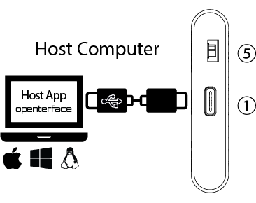
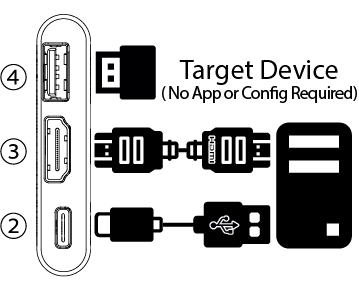

# Specifications
<!--  -->

## Overview

- Dimensions: 61 x 13.5 x 53 mm / 2.40 x 0.53 x 2.09 inches (Length x Width x Height)
- Weight: 48g
- Casing: Aluminium profile casing

## Interfaces

- ①  **Host USB-C Port** (Female): As a USB device port, connecting to the Host computer for data transfer via built-in USB hub
- ②  **Target USB-C Port** (Female): As a USB device port, connecting to the Host computer for emulating keyboard and mouse HID output via built-in USB hub
- ③  **HDMI Input Port (Female)**: HDMI source input from the Target computer
- ④  **Switchable USB-A 2.0 Port (Female)**: As a USB host port, utilized by either the host computer or the target computer at any given time, but not simultaneously
- ⑤  **Toggle Switch**: For toggling the connection of the USB-A 2.0 port between the host and the target computer

## Power

- Connection Type: USB-C powered. No external power supply required.

## Video

- Max Video Input: Up to 3840x2160@30Hz, via HDMI (Note: With the use of an adapter, it can also support VGA, Micro HDMI, DVI, and other video input sources)
- Supported Video Resolutions: Up to 1920x1080@30Hz
- Video Compression Methods: YUV, MJPEG
- Latency: Under 140 milliseconds

## Audio

- Audio Capture Mode: HDMI embedded audio

## Environmental

- Operating Temperature: 0°C to 40°C
- Storage Temperature: -10°C to 50°C
- Humidity: 80% RH

