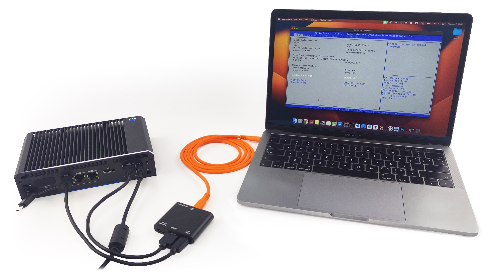

# Use Cases
## ***Versatile Portability for On-the-Go Troubleshooting***
Pairing the Openterface Mini-KVM with Clockwork's uConsole transforms this portable Pi computer into a handy KVM tool, perfect for plug-and-play and quick troubleshooting of any nearby headless devices. This setup is especially beneficial for field engineers and tech enthusiasts who require a compact and efficient solution for managing and diagnosing devices on the go.

<blockquote class="twitter-tweet" data-media-max-width="560">
Here&#39;s a quick demo video of our Qt host app running on the Pi within this uConsole. <a href="https://t.co/xwrOE9pCcF">pic.twitter.com/xwrOE9pCcF</a>
&mdash; TechxArtisan (@TechxArtisan) <a href="https://twitter.com/TechxArtisan/status/1807824199152722019?ref_src=twsrc%5Etfw">July 1, 2024</a></blockquote> 

## ***Streamlined Server Management***
Ideal for IT professionals involved in the maintenance and operation of server rooms, our Mini-KVM enables control of multiple servers from your own laptop as a single workstation, enhancing operational efficiency.

## ***Simplified Setup for Tech Enthusiasts***
This product eases the setup process for micro-computer enthusiasts working with devices like Raspberry Pi and Jetson Nano. It allows direct control from a main computer, negating the need for additional peripherals.

## ***Unified Control for Diverse Devices***
Perfect for professionals juggling between personal and work computers, or managing devices such as ATMs, VLTs, and kiosks. The Openterface Mini-KVM offers a unified interface that simplifies the management of multiple devices.

## ***Secure Operations for Sensitive Tasks***
Professionals managing tasks that require network segregation, such as managing cryptocurrency assets, will find this product indispensable for maintaining secure, local operations.

## ***Efficient Integration for Mixed Workflows***
Users who frequently switch between personal and work computers, or those managing edge computing devices, will benefit from the streamlined workflow integration that Openterface Mini-KVM provides.

