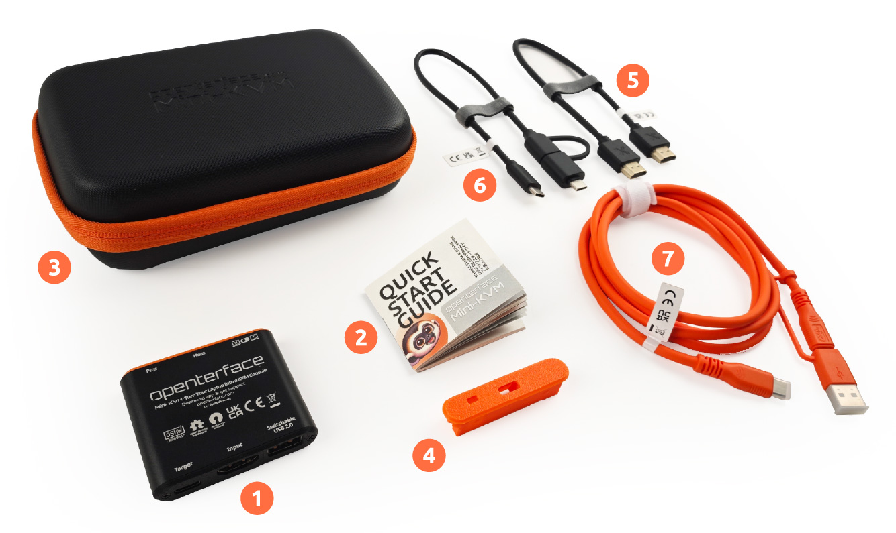

# What's In The Box

Explore our two purchase options designed to meet your needs, whether you're looking for the essentials or a complete set of tools.

## Package 1: Basic Pack

{:style="width:680px"}

1. Core Product: Openterface Mini-KVM
2. Quick Start Guide

## Package 2: Toolkit Pack

{:style="width:680px"}

1. Core Product: Openterface Mini-KVM
2. Quick Start Guide
3. Toolkit Bag (165 x 110 x 50mm)
4. Extension Pin Cap
5. HDMI Male-to-Male Cable (30cm)
6. Type-C Male to USB-A Male Cable (0.3m) with USB-A Female to USB-C Male Adapter
7. Type-C Male-to-Male Cable (1.5m) with USB-C Female to USB-A Male Adapte

{:style="width:680px"}