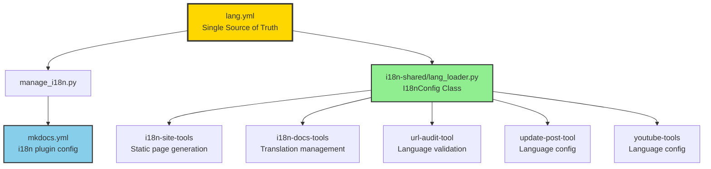
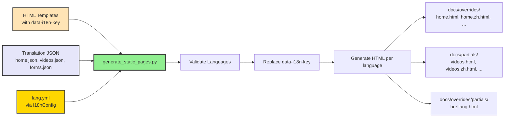
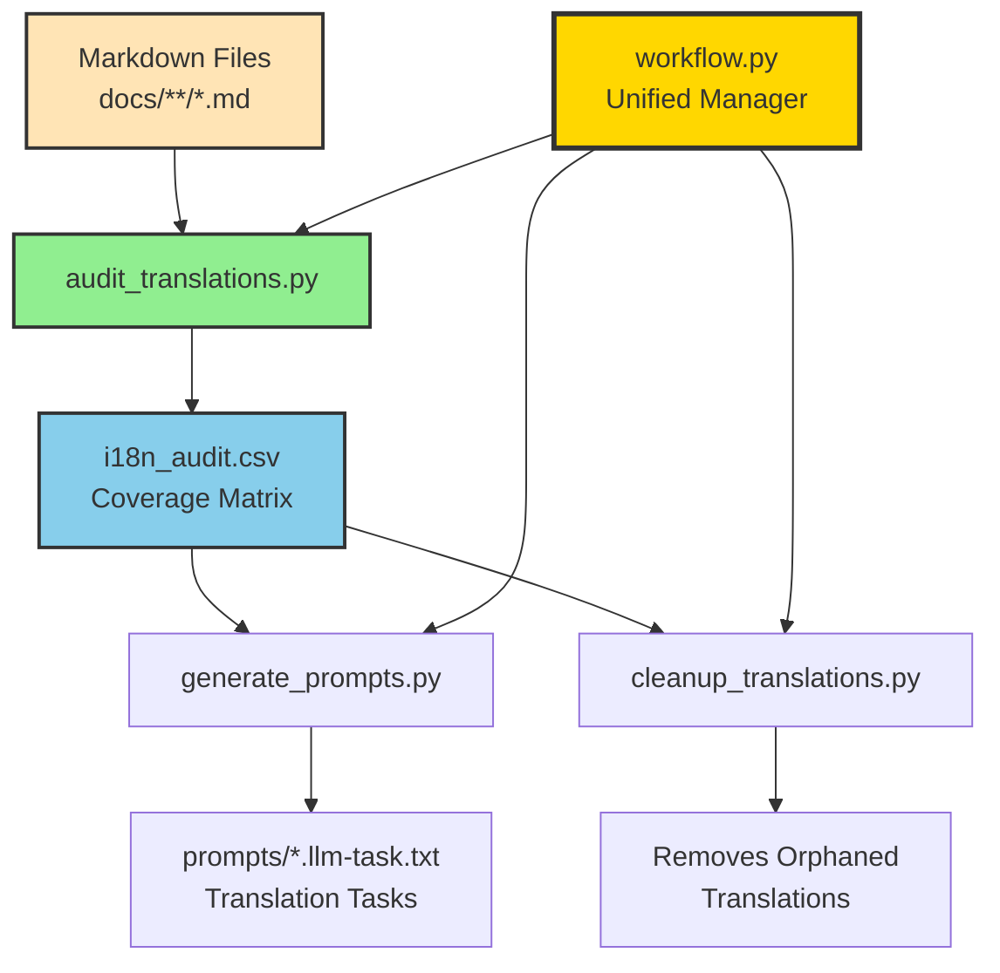
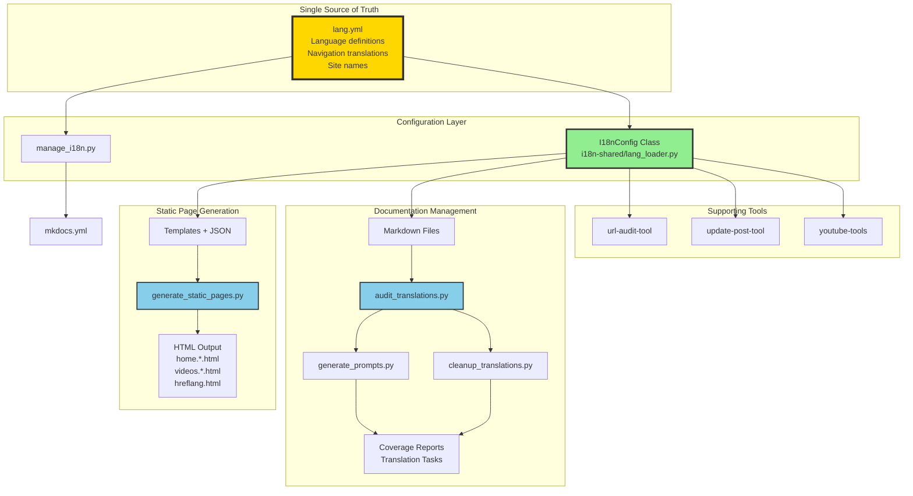
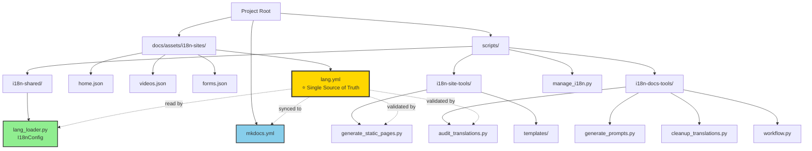
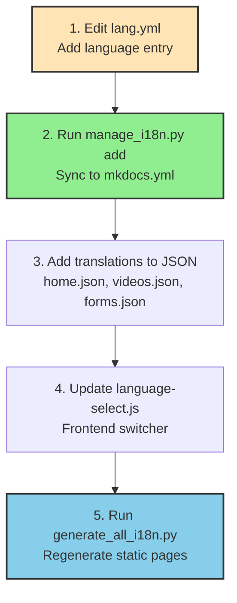
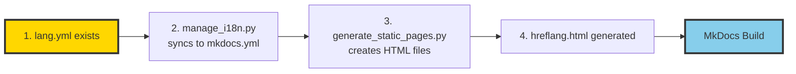

# i18n Workflows Summary

This document provides visual summaries of the key internationalization workflows using Mermaid diagrams.

## Table of Contents

1. [Configuration Flow](#configuration-flow)
2. [Static Page Generation Flow](#static-page-generation-flow)
3. [Documentation Translation Flow](#documentation-translation-flow)
4. [Complete i18n Workflow Overview](#complete-i18n-workflow-overview)
5. [File Hierarchy](#file-hierarchy)

---

## Configuration Flow

How `lang.yml` (Single Source of Truth) flows to all tools and configurations.

---

## Static Page Generation Flow

Process of generating multilingual static HTML pages from templates.

---

## Documentation Translation Flow

Workflow for managing and auditing Markdown file translations.

---

## Complete i18n Workflow Overview

High-level view of the entire i18n system architecture.

---

## File Hierarchy

Visual representation of the key file structure.

---

## Quick Reference: Adding a New Language

Step-by-step workflow for adding support for a new language.

---

## Build Process Dependencies

Required steps before running MkDocs build.

---

For detailed information about each component and workflow, see [I18N_WORKFLOW_AND_HIERARCHY.md](./I18N_WORKFLOW_AND_HIERARCHY.md).

